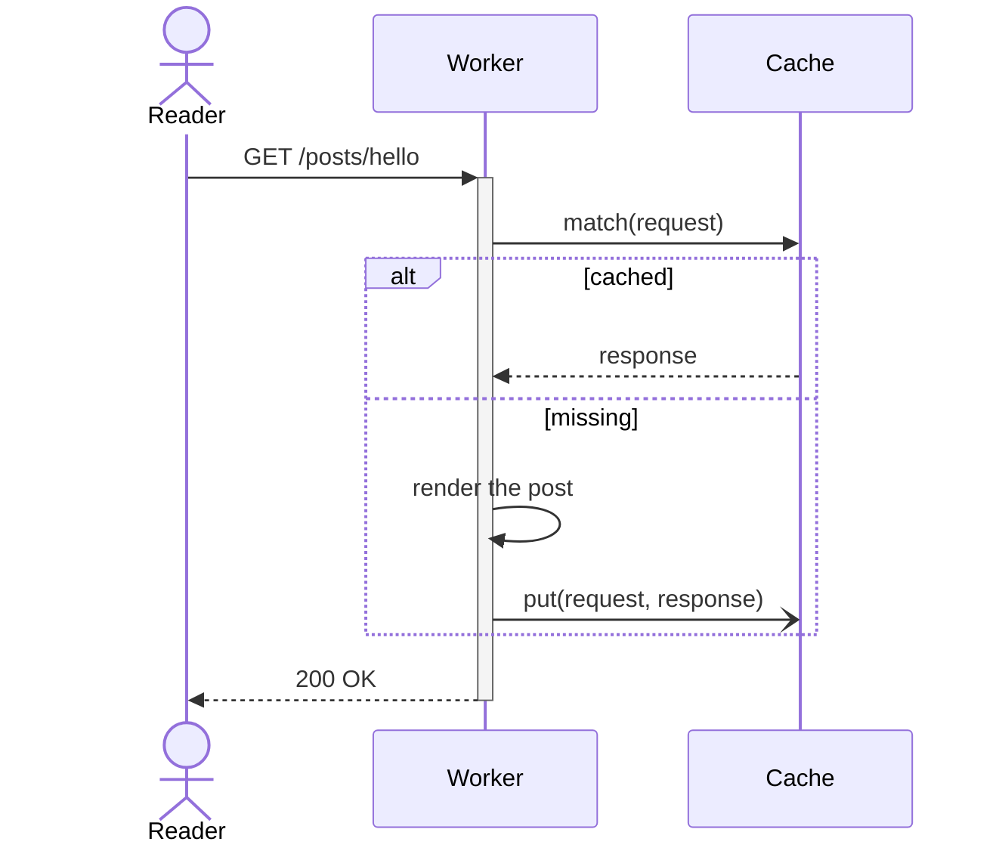
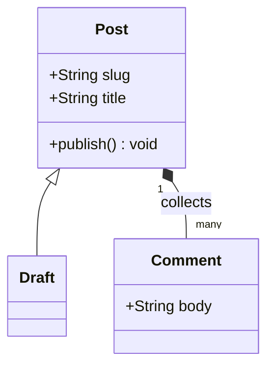
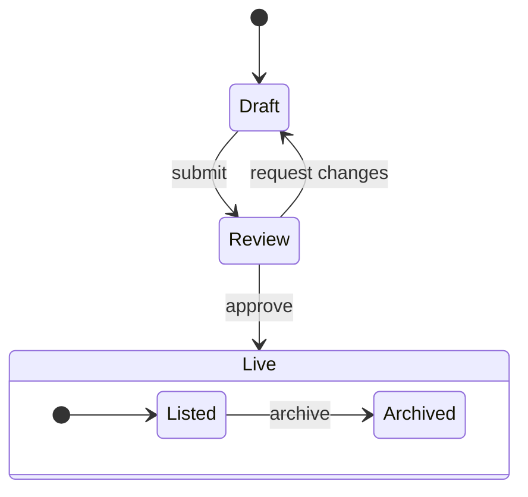

A diagram written as text lives beside the prose it explains: it diffs, it reviews, and it
changes in the same commit as the code it describes. This guide draws those diagrams as SVG
on the server, wherever one appears: in a markdown post, in a string you render for a feed,
and directly in a `remix/component` view. It uses [`@sdxc/diagram`](/api/diagram) together
with [`@sdxc/markdown`](/api/markdown).

```bash
npm add @sdxc/diagram @sdxc/markdown @sdxc/result remix
```

The page carries finished SVG: no script runs to draw it, and no stylesheet or font loads for
it. Lines and text take the color of the text around them, so a diagram follows the page into
dark mode.

## Write a diagram

Diagrams use [Mermaid](https://mermaid.js.org)'s syntax, the one GitHub renders, so the same
file shows the same picture on GitHub and on your site. The first line names the kind:
`sequenceDiagram`, `classDiagram`, `stateDiagram-v2` or `flowchart` with a direction.
Write it inside a fenced block marked `mermaid`:

```text
sequenceDiagram
    actor Reader
    participant Worker
    participant Cache
    Reader->>+Worker: GET /posts/hello
    Worker->>Cache: match(request)
    alt cached
        Cache-->>Worker: response
    else missing
        Worker->>Worker: render the post
        Worker-)Cache: put(request, response)
    end
    Worker-->>-Reader: 200 OK
```

That source draws this:



Class and state diagrams read the same way. A class diagram puts each parent and each whole
above the classes that point at it, whichever way round the relation is written:



A state diagram nests composite states, each with its own start:



Labels break onto a new line at `<br>`. A `title` or `accTitle:` statement names the drawing
for screen readers, and `accDescr:` describes it; without one, the drawing is named after its
kind. The [package reference](/api/diagram) lists every statement each kind reads.

## Draw a diagram from a string

`toSVG` takes the source and answers with a `Result` holding the markup:

```typescript 
import { toSVG } from "@sdxc/diagram";
import { isFailure } from "@sdxc/result";

export function architecture(): string {
	let result = toSVG("flowchart LR\n  Browser --> Worker --> D1[(D1)]");
	if (isFailure(result)) {
		let { reason, line, column } = result.error;
		return `<code>${reason} at ${line}:${column}</code>`;
	}
	return result.data; // '<svg xmlns="http://www.w3.org/2000/svg" viewBox="…" role="img">…'
}
```

The string is safe to place in HTML or XHTML, or to save as an `.svg` file. A statement
outside the supported syntax fails with a `DiagramError` whose message ends in
`line:column`, while `reason`, `index`, `line` and `column` carry the same place for a tool
that points an editor at it.

When you want the structure rather than a string, `parseDiagram` answers with a JSON tree of
SVG elements rooted at `svg`, which a build can store and a renderer can draw later.

## Find the diagrams in markdown

`diagram` from `@sdxc/diagram/markdown` is a walk visitor. It turns each fenced block
marked `mermaid` into a `diagram` tag carrying a `source` attribute and leaves every other
code block alone, so it composes with a highlighter in one walk:

```typescript 
import { diagram } from "@sdxc/diagram/markdown";
import { highlight } from "@sdxc/highlight/markdown";
import { Markdown } from "@sdxc/markdown";

export function preparePost(document: Markdown.Document) {
	return Markdown.walk(document, Markdown.compose(diagram, highlight));
}
```

`Markdown.compose` runs the `code` handlers in order: a mermaid fence becomes a tag, which
ends its chain, and every other block reaches the highlighter as the code node it was.

A diagram that does not parse fails the walk. The failure's `position` is where the fence
sits in the document, and its `cause` is the `DiagramError` with the place inside the
diagram, so a broken post fails the build with both:

```typescript 
import { DiagramError } from "@sdxc/diagram";
import { diagram } from "@sdxc/diagram/markdown";
import { Markdown } from "@sdxc/markdown";
import { isFailure } from "@sdxc/result";

export function checkDiagrams(path: string, source: string): string | null {
	let parsed = Markdown.parse(source);
	if (isFailure(parsed)) return `${path}: ${parsed.error.message}`;

	let walked = Markdown.walk(parsed.data.document, diagram);
	if (!isFailure(walked)) return null;

	let fence = walked.error.position?.start.line ?? 0;
	let cause = walked.error.cause;
	if (!(cause instanceof DiagramError))
		return `${path}:${fence}: ${walked.error.message}`;
	return `${path}:${fence + cause.line}: ${cause.reason}`;
}
```

The fence's opening line comes first, so adding the line inside the diagram lands on the
statement itself.

For content you do not control, or for posts stored in a database and rendered on request,
build the visitor with `createDiagramVisitor({ invalid: "keep" })`. A diagram that does not
parse then stays the code block its author wrote, and the walk succeeds.

## Draw the tags in a route

`DiagramTag` from `@sdxc/diagram/ui` is a `remix/component` component whose props are the
attributes the visitor writes, so it goes straight into the `components` map of `toRemix`:

```tsx 
import type { Markdown } from "@sdxc/markdown";

import { DiagramTag } from "@sdxc/diagram/ui";
import { toRemix } from "@sdxc/markdown/remix";

export function renderPost(document: Markdown.Document) {
	return toRemix(document, { components: { diagram: DiagramTag } });
}
```

`Diagram` draws one outside markdown, in any view:

```tsx 
import type { Handle } from "remix/component";

import { Diagram } from "@sdxc/diagram/ui";

export function RequestFlow(handle: Handle) {
	return () => (
		<figure>
			<Diagram
				source={
					"flowchart LR\n  Request --> Router --> Controller --> Response"
				}
			/>
			<figcaption>Every request takes the same four steps.</figcaption>
		</figure>
	);
}
```

Both build the SVG as elements the renderer owns, and render source that does not parse as a
code block, so a reader still sees what the author wrote.

## Match your theme

Lines and text use `currentColor`. Node bodies fill with `--diagram-fill`, and notes, groups
and block labels with `--diagram-tint`; both fall back to the page background, so set them
only where your surfaces differ from it:

```css 
.prose svg[role="img"] {
	color: var(--text-muted);
	--diagram-fill: var(--surface-raised);
}
```

The drawing shrinks to its container and never grows past its natural size.

## Render to HTML for feeds and email

A feed item or an email body wants a string. `renderDiagram` is the tag renderer for
`toHTML`, turning each `diagram` tag into the markup `toSVG` writes:

```typescript 
import type { Markdown } from "@sdxc/markdown";

import { renderDiagram } from "@sdxc/diagram/markdown";
import { toHTML } from "@sdxc/markdown/html";

export function renderHTML(document: Markdown.Document): string {
	return toHTML(document, { tags: { diagram: renderDiagram } });
}
```

Feed readers that show inline SVG draw the diagram, and its `title` names it for the ones
that read the text.

## Where to go next

- [A markdown content pipeline](/docs/content-and-feeds/markdown-pipeline) — the parse, walk
  and render this guide plugs diagrams into.
- [Render TeX math](/docs/content-and-feeds/math) — the same tag-and-renderer approach for
  formulas.
- [`@sdxc/diagram`](/api/diagram) — every statement each diagram kind reads.
