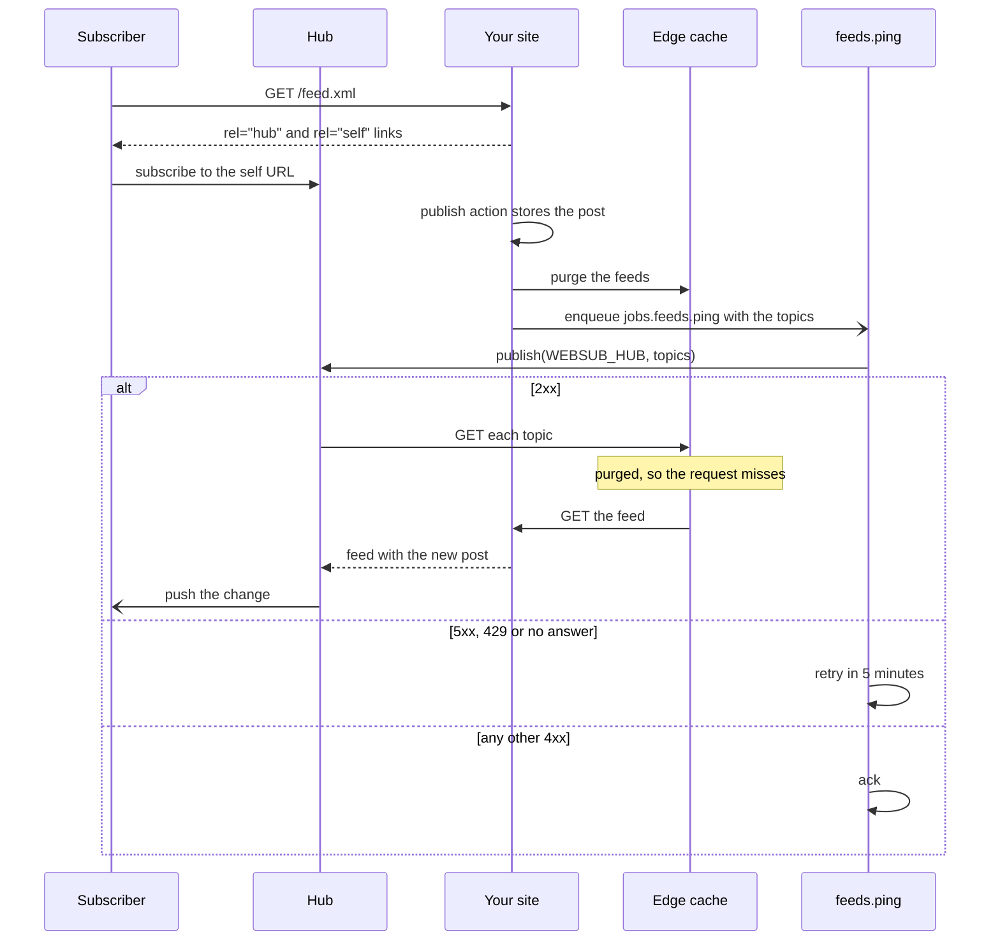

A feed reader asks for a document in whichever format it was built around, so a site that
wants to be followed publishes more than one. This guide serves the same posts as RSS 2.0, Atom
1.0 and JSON Feed 1.1 from three small Remix v3 actions, advertises them to browsers and
readers, tells a WebSub hub the moment they change, and publishes an OPML list a reader can
import in one step.

It combines [`@sdxc/rss`](/api/rss), [`@sdxc/atom`](/api/atom),
[`@sdxc/json-feed`](/api/json-feed), [`@sdxc/websub`](/api/websub) and
[`@sdxc/opml`](/api/opml), served through [`@sdxc/http`](/api/http). The posts come from the
pipeline in [A markdown content pipeline](/docs/content-and-feeds/markdown-pipeline).

```bash
npm add remix @sdxc/rss @sdxc/atom @sdxc/json-feed @sdxc/websub @sdxc/opml
npm add @sdxc/http @sdxc/jobs @sdxc/markdown @sdxc/result
```

## One list of entries

Each format names the same facts differently, so build the facts once and let each action map
them. A feed item's body is HTML, which is what `toHTML` gives you from a parsed post:

```typescript 
import { toHTML } from "@sdxc/markdown/html";
import { isFailure } from "@sdxc/result";

import { listPosts } from "~/app/content/list-posts";
import { readPost } from "~/app/content/posts";
import routes from "~/routes/web";

export interface FeedEntry {
	url: string;
	title: string;
	summary: string;
	html: string;
	publishedAt: Date;
	tags: string[];
}

export async function feedEntries(origin: string, limit = 20): Promise<FeedEntry[]> {
	let entries: FeedEntry[] = [];

	for (let post of (await listPosts()).slice(0, limit)) {
		let read = await readPost(post.slug);
		if (read === null || isFailure(read)) continue;

		let url = new URL(routes.posts.show.href({ slug: post.slug }), origin).href;
		let html = toHTML(read.data.document);
		let { title, description: summary, publishedAt, tags } = post;
		entries.push({ url, title, summary, html, publishedAt, tags });
	}

	return entries;
}
```

Every URL is absolute. Readers fetch a feed from one place and display it in another, so a
relative link in an item resolves against whatever the reader happens to use as its base.

Give each feed a route of its own:

```typescript 
import { get, route } from "remix/routes";

export default route({
	posts: { index: get("/posts"), show: get("/posts/:slug") },
	feeds: {
		rss: get("/feed.xml"),
		atom: get("/atom.xml"),
		json: get("/feed.json"),
		opml: get("/feeds.opml"),
	},
});
```

## RSS 2.0

`new RSS(channel)` takes the channel, `addItem` appends, and `toString` writes the XML with the
namespaces its extensions need already declared. `xml` from `@sdxc/http/response` sets the
content type.

```typescript 
import { xml } from "@sdxc/http/response";
import { RSS } from "@sdxc/rss";
import { createAction } from "remix/router";

import { feedEntries } from "~/app/feeds/entries";
import routes from "~/routes/web";

export default createAction(routes.feeds.rss, async (ctx) => {
	let self = new URL(routes.feeds.rss.href(), ctx.url).href;
	let entries = await feedEntries(ctx.url.origin);

	let rss = new RSS({
		title: "Example",
		description: "Notes on building for the web.",
		link: ctx.url.origin,
		language: "en",
		lastBuildDate: entries[0]?.publishedAt.toUTCString(),
		atomLink: { rel: "self", href: self, type: "application/rss+xml" },
	});

	for (let entry of entries) {
		rss.addItem({
			guid: { value: entry.url, isPermaLink: true },
			title: entry.title,
			description: entry.summary,
			link: entry.url,
			category: entry.tags,
			pubDate: entry.publishedAt.toUTCString(),
			contentEncoded: entry.html,
		});
	}

	return xml(rss.toString());
});
```

RSS dates are RFC 822 strings, which is what `toUTCString()` writes. The `guid` is the
permalink, marked as one, so a reader that already showed an item never shows it twice after
you edit its title. `description` carries the summary and `contentEncoded` the full body; the
HTML in both is escaped on the way out, as the format requires. The `atomLink` with
`rel="self"` names the feed's canonical address, which is what readers and hubs key a
subscription by.

## Atom 1.0

Atom requires an `id`, a `title` and an `updated` on the feed and on every entry, and the
constructor and `addEntry` throw when one is missing, so the fields you always supply are the
ones you can't forget. Dates are RFC 3339, which is `toISOString()`.

```typescript 
import { Atom } from "@sdxc/atom";
import { xml } from "@sdxc/http/response";
import { createAction } from "remix/router";

import { feedEntries } from "~/app/feeds/entries";
import routes from "~/routes/web";

export default createAction(routes.feeds.atom, async (ctx) => {
	let self = new URL(routes.feeds.atom.href(), ctx.url).href;
	let entries = await feedEntries(ctx.url.origin);

	let atom = new Atom({
		id: self,
		title: "Example",
		updated: (entries[0]?.publishedAt ?? new Date()).toISOString(),
		author: { name: "Ada Lovelace", uri: ctx.url.origin },
		link: [
			{ href: ctx.url.origin, rel: "alternate", type: "text/html" },
			{ href: self, rel: "self", type: "application/atom+xml" },
		],
	});

	for (let entry of entries) {
		atom.addEntry({
			id: entry.url,
			title: entry.title,
			updated: entry.publishedAt.toISOString(),
			published: entry.publishedAt.toISOString(),
			summary: entry.summary,
			content: { type: "html", value: entry.html },
			link: { href: entry.url, rel: "alternate" },
			category: entry.tags,
		});
	}

	return xml(atom.toString());
});
```

The imports match the RSS action, with `Atom` from `@sdxc/atom` in place of `RSS`. An entry's
`id` must never change, so use the permalink only if permalinks never change on your site; a
`tag:` URI minted from the post's creation date is the alternative when they might.

## JSON Feed 1.1

Fields are camelCase here and written under the format's own names, so `homePageUrl` becomes
`home_page_url` in the document. Serve it under `JSONFeed.mediaType`, which is
`application/feed+json`:

```typescript 
import { JSONFeed } from "@sdxc/json-feed";
import { createAction } from "remix/router";

import { feedEntries } from "~/app/feeds/entries";
import routes from "~/routes/web";

export default createAction(routes.feeds.json, async (ctx) => {
	let feed = new JSONFeed({
		title: "Example",
		homePageUrl: ctx.url.origin,
		feedUrl: new URL(routes.feeds.json.href(), ctx.url).href,
		language: "en",
		authors: [{ name: "Ada Lovelace", url: ctx.url.origin }],
	});

	for (let entry of await feedEntries(ctx.url.origin)) {
		feed.addItem({
			id: entry.url,
			url: entry.url,
			title: entry.title,
			summary: entry.summary,
			contentHtml: entry.html,
			datePublished: entry.publishedAt.toISOString(),
			tags: entry.tags,
		});
	}

	return new Response(feed.toString(), {
		headers: { "content-type": JSONFeed.mediaType },
	});
});
```

A field you leave empty is left out of the document, so a reader never has to test for a
`null` you did not mean to send.

## Let readers find them

Browsers and feed readers look for `<link rel="alternate">` in a page's head. Render all three
there, the one you want people to subscribe to first, since readers take the first as the
site's main feed:

```tsx 
import routes from "~/routes/web";

export function FeedLinks() {
	return () => (
		<>
			<link
				rel="alternate"
				type="application/rss+xml"
				title="Example"
				href={routes.feeds.rss.href()}
			/>
			<link
				rel="alternate"
				type="application/atom+xml"
				title="Example (Atom)"
				href={routes.feeds.atom.href()}
			/>
			<link
				rel="alternate"
				type="application/feed+json"
				title="Example (JSON Feed)"
				href={routes.feeds.json.href()}
			/>
		</>
	);
}
```

Place `<FeedLinks />` in your document layout's `<head>`. This is the markup `Feed.discover` from [`@sdxc/feed`](/api/feed) follows, so someone can paste
your homepage into a reader built on it instead of hunting for `/feed.xml`.

## Push updates with WebSub

Readers poll, and a poll interval is how long a new post waits to be seen. A WebSub hub removes
the wait: your feed names a hub, subscribers register with it, and when you ping it the hub
fetches the feed and pushes the change. The hub URL goes in a `WEBSUB_HUB` variable on your
Worker, so changing hubs is a configuration change.

A subscription and one published post travel like this, with the purge ahead of the ping:



A subscriber may look for the hub in the response's `Link` header or in the document, so
advertise it in both. One helper builds the two for any feed: the `rel="self"` and `rel="hub"`
links for the document, and the header value that `links` writes:

```typescript 
import { links } from "@sdxc/websub/publisher";
import { env } from "cloudflare:workers";

export function advertiseHub(self: string, type: string) {
	return {
		links: [
			{ rel: "self", href: self, type },
			{ rel: "hub", href: env.WEBSUB_HUB },
		],
		headers: { link: links({ hubs: [env.WEBSUB_HUB], self }) },
	};
}
```

In the RSS action, write `let hub = advertiseHub(self, "application/rss+xml")`, pass
`hub.links` as the channel's `atomLink` in place of the lone `self` link, and answer with
`xml(rss.toString(), { headers: hub.headers })`. The Atom action spreads the same `links`
after its `alternate` link, and JSON Feed takes `hubs: [{ type: "WebSub", url: env.WEBSUB_HUB }]`
on the feed plus the same headers on its `Response`.

The ping itself is an outbound request to someone else's server, so run it as a job: the
request that published the post stays fast, and a hub that is down gets retried rather than
forgotten. Declare it beside your other jobs (see
[Background jobs and cron](/docs/data-and-background-work/jobs-and-cron) for the dispatcher):

```typescript 
import { job, jobs } from "@sdxc/jobs";
import * as s from "remix/data-schema";

export default jobs({
	feeds: {
		ping: job({ input: s.object({ topics: s.array(s.string()) }) }),
	},
});
```

```typescript 
import { createJobHandler } from "@sdxc/jobs";
import { isFailure } from "@sdxc/result";
import { publish } from "@sdxc/websub/publisher";
import { env } from "cloudflare:workers";

import jobs from "~/app/jobs";

export default createJobHandler(jobs.feeds.ping, async (ctx) => {
	let pinged = await publish(env.WEBSUB_HUB, ctx.input.topics);
	if (!isFailure(pinged)) return;

	let { status } = pinged.error;
	ctx.log.set({ websub: { status, topics: ctx.input.topics.length } });

	if (status === null || status >= 500 || status === 429) {
		return ctx.retry({ delay: "5 minutes", cause: pinged.error });
	}
	return ctx.ack(pinged.error.message);
});
```

`publish` answers with a `Result`: success is any 2xx, and a failure carries the hub's status,
or `null` when there was no answer to read — a timeout, a network failure, or a hub or topic
that is not an absolute URL. A server error, a rate limit or a missing answer is worth another
attempt; a 4xx means the hub refused this ping and will refuse the next one too. The logged
`websub.status` is where a misconfigured hub shows up, as a run of `null` retries.

The topics are the absolute URLs of every feed a new post changes:

```typescript 
import routes from "~/routes/web";

export function feedTopics(base: URL): string[] {
	let feeds = [routes.feeds.rss, routes.feeds.atom, routes.feeds.json];
	return feeds.map((feed) => new URL(feed.href(), base).href);
}
```

Enqueue the job from whatever action publishes a post, after the post is stored, with
`await ctx.jobs.enqueue(jobs.feeds.ping, { topics: feedTopics(ctx.url) })`. `ctx.jobs` is
published by `jobEnqueuer(queue)` from `@sdxc/jobs/router`, given the same queue your
dispatcher delivers from, so the action writes the message without loading the job's code
(see [Background jobs and cron](/docs/data-and-background-work/jobs-and-cron)).

The hub fetches each topic the moment it is pinged. If you cache the feeds at the edge, purge
them before enqueuing, or the hub reads the copy without the new post.

## Publish an OPML list

OPML is how a subscription list moves between readers. Publishing one with your own feeds, and
the sites you read, lets someone follow all of it in a single import:

```typescript 
import type { OPML } from "@sdxc/opml";

import { xml } from "@sdxc/http/response";
import { stringify } from "@sdxc/opml";
import { createAction } from "remix/router";

import routes from "~/routes/web";

const BLOGROLL: OPML.Outline[] = [
	{
		title: "Friend",
		feedUrl: "https://friend.example/feed.xml",
		folder: "Friends",
	},
];

export default createAction(routes.feeds.opml, (ctx) => {
	let feedUrl = new URL(routes.feeds.rss.href(), ctx.url).href;
	let outlines = [
		{ title: "Example", feedUrl, siteUrl: ctx.url.origin },
		...BLOGROLL,
	];

	let title = "Example and friends";
	return xml(stringify(outlines, { title, dateCreated: new Date() }));
});
```

An outline with a `folder` is written inside one `<outline>` per folder, so a reader files it the
way you grouped it. Every value is escaped by the XML layer, so an `&` in a title or a query
string is safe.

## Where to go next

- [A markdown content pipeline](/docs/content-and-feeds/markdown-pipeline) — where the posts
  and their HTML come from.
- [Join the IndieWeb](/docs/content-and-feeds/indieweb) — notify the pages your posts link to.
- [Cache on Cloudflare Workers](/docs/data-and-background-work/cache-on-workers) — keep feeds
  cheap to serve without delaying a hub's fetch.
- [`@sdxc/feed`](/api/feed) — read RSS, Atom and JSON Feed through one normalized shape.
