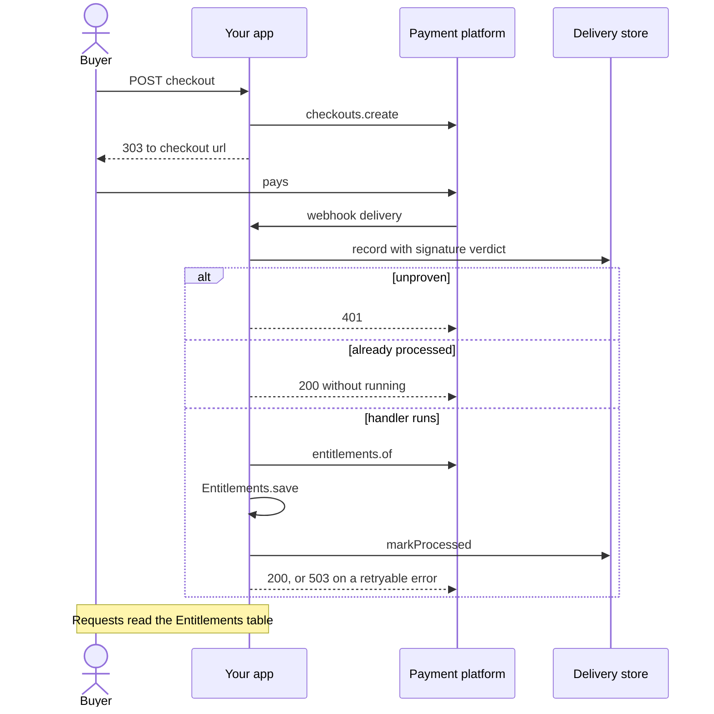

Charging for an app is mostly bookkeeping around a payment platform: linking your accounts to its
customers, sending buyers to its checkout, learning when a subscription starts or lapses, and
deciding on every request what the account may use. [`@sdxc/billing`](/api/billing) puts one
contract in front of the platform, so the rest of your code reads `Customer`, `Subscription` and
`EntitlementState` and the vendor's name appears in a single module.

This guide sells a `pro` plan through a hosted checkout, keeps a local projection of what each
customer holds in sync from webhooks and a nightly job, and gates a feature on that projection.
[`@sdxc/jobs`](/api/jobs) runs the nightly job, and [`@sdxc/authz`](/api/authz) folds the
plan into the same checks as roles and ownership.

```bash
npm add @sdxc/billing @sdxc/jobs @sdxc/result @sdxc/http remix @sdxc/authz
```

## Configure the provider

A provider is a class built once at module scope. Its constructor reaches nothing, so importing
it costs no startup work, and a route and a job share the same instance:

```typescript 
import type { Billing } from "@sdxc/billing";

import { PolarBilling } from "@sdxc/billing/providers/polar";
import { env } from "cloudflare:workers";

export const billing: Billing = new PolarBilling({
	accessToken: () => env.POLAR_ACCESS_TOKEN,
	webhookSecret: () => env.POLAR_WEBHOOK_SECRET,
	products: { pro: "prod_7f3c…" },
	features: { reports: "benefit_91ab…" },
});
```

Products and features are your own slugs mapped to the platform's ids. A checkout is opened for
`"pro"`, and a snapshot answers `products: ["pro"]` and `features: { reports: true }`, so no
platform id leaks into a controller or a column. The credentials are functions, read on the first
call that needs them, and a signing secret that is unset or unreadable makes verification fail
rather than throw.

Annotating the export as `Billing` keeps every caller on the contract. The same file is the only
one that changes to move platforms: `StripeBilling` from `@sdxc/billing/providers/stripe` and
`MercadoPagoBilling` from `@sdxc/billing/providers/mercado-pago` answer the same groups, and
`MemoryBilling` from `@sdxc/billing/providers/memory` is a full in-memory platform for tests.
Groups only some platforms offer, such as `portal` and `usage`, are optional on the contract,
and `supports(billing, "portal")` narrows one to present before you call it.

## Publish it on the request

The billing middleware publishes the provider as `ctx.billing`. Importing it is what types the
property, and its `entitlements` option is the reader the feature gate calls further down:

```typescript 
import billingMiddleware from "@sdxc/billing/middleware";
import { createRouter } from "remix/router";

import { Entitlements } from "~/app/data/entitlements";
import { billing } from "~/app/lib/billing";

export const router = createRouter({
	middleware: [
		billingMiddleware({
			provider: billing,
			entitlements: (ctx) => Entitlements.snapshot(ctx.db, ctx.account.id),
		}),
	],
});
```

Put it after the middleware that publishes `ctx.db` and `ctx.account`, the signed-in account
your auth middleware resolves. `Entitlements` is your own table holding one snapshot per
account, written by the sync below.

## Link each account to a customer

Every platform customer carries your own account id as its `externalId`, which is what lets a
checkout, a snapshot and a webhook name the same person. Resolve it when an account signs up,
creating the customer only when the platform holds none:

```typescript 
import type { Billing, BillingError, Customer } from "@sdxc/billing";
import type { Result } from "@sdxc/result";

import { isSuccess } from "@sdxc/result";

import type { Account } from "~/app/data/accounts";

export async function linkCustomer(
	billing: Billing,
	account: Account,
): Promise<Result<Customer, BillingError>> {
	let linked = await billing.customers.find({ externalId: account.id });
	if (isSuccess(linked) || linked.error.code !== "not_found") return linked;

	return await billing.customers.create({
		email: account.email,
		externalId: account.id,
		name: account.name,
	});
}
```

Nothing in the package throws: every call answers a `Result<T, BillingError>`, and a lookup that
matches nothing is a `not_found` failure rather than `null`. The error's `code` is what you
branch on. `rate_limited` is the one marked `retryable`, and `unknown` means a timeout or a 5xx
where the call may or may not have taken effect.

## Open a hosted checkout

A purchase is a link. `checkouts.create` answers a session whose `url` is the platform's own
payment page, and the route owns the redirect:

```typescript 
import { redirect } from "@sdxc/http/response";
import { badGateway } from "@sdxc/http/response/html";
import { isFailure } from "@sdxc/result";
import { createAction } from "remix/router";

import routes from "~/routes/web";

export default createAction(routes.billing.checkout, async (ctx) => {
	let checkout = await ctx.billing.checkouts.create({
		product: "pro",
		customer: { externalId: ctx.account.id },
		returnTo: new URL(routes.billing.index.href(), ctx.url).toString(),
	});

	if (isFailure(checkout) || checkout.data.url === null) {
		ctx.log.warn("billing.checkout_failed");
		return badGateway("Checkout is unavailable right now. Please try again.");
	}

	return redirect(checkout.data.url, { status: redirect.Status.SeeOther });
});
```

A session with no `url` is no longer payable, which is why it is checked before redirecting.
When a double-submitted form must not open two sessions, pass an `idempotencyKey` derived from
the attempt. A customer who already subscribes goes to `ctx.billing.portal.create(...)`
instead, behind a `supports()` check, where they change plans and payment methods on the
platform's page.

No call creates a subscription. One exists once the checkout completes, and your app learns of
it from an event.

## Sync what the customer holds

`entitlements.of` answers everything a customer holds right now, in one call. Write that
snapshot into your own table, and have every request read the table, so the platform stays off
the request path:

```typescript 
import type { Billing, BillingError, CustomerRef } from "@sdxc/billing";
import type { Result } from "@sdxc/result";
import type { Database } from "remix/data-table";

import { isFailure, success } from "@sdxc/result";

import { Entitlements } from "~/app/data/entitlements";

export async function syncEntitlements(
	db: Database,
	billing: Billing,
	customer: CustomerRef,
): Promise<Result<boolean, BillingError>> {
	let state = await billing.entitlements.of(customer);
	if (isFailure(state)) return state;
	if (state.data.externalId === null) return success(false);

	await Entitlements.save(db, state.data.externalId, state.data);
	return success(true);
}
```

The snapshot is keyed by `externalId`, your account id, and a customer who never had one was
never linked to an account, so there is nothing to write. Store `readAt` beside it: deliveries
arrive out of order, and `Entitlements.save` skipping a snapshot older than the stored one is
what stops a late event from rolling an account back.

## Receive the platform's webhooks

A purchase reaches your app twice: once as the buyer's redirect, and again as the platform's
webhook, which is the one that changes what the account holds:



`BillingWebhook` is the whole receiver. The provider verifies the signature, a store records the
delivery, and a handler per event type does the work. Every handler here does the same thing,
on purpose:

```typescript 
import type { RequestContext } from "remix/router";

import { BillingWebhook } from "@sdxc/billing";
import { isFailure } from "@sdxc/result";

import { WebhookDeliveries } from "~/app/data/webhook-deliveries";
import { billing } from "~/app/lib/billing";
import { openDatabase } from "~/app/lib/database";
import { syncEntitlements } from "~/app/services/entitlements";

async function resync(ctx: RequestContext, customerId: string | null): Promise<void> {
	if (customerId === null) return;
	let synced = await syncEntitlements(ctx.db, billing, { id: customerId });
	if (isFailure(synced)) throw synced.error;
}

export default new BillingWebhook(
	billing,
	{
		"subscription.activated": (event, ctx) =>
			resync(ctx, event.subscription.customerId),
		"subscription.updated": (event, ctx) =>
			resync(ctx, event.subscription.customerId),
		"subscription.canceled": (event, ctx) =>
			resync(ctx, event.subscription.customerId),
		"subscription.revoked": (event, ctx) =>
			resync(ctx, event.subscription.customerId),
		"order.paid": (event, ctx) => resync(ctx, event.order.customerId),
	},
	{ store: new WebhookDeliveries(openDatabase) },
);
```

A delivery says that something changed, and only a fresh snapshot says what is true now, so a
handler re-reads rather than applying the payload as a diff. The handler map is typed from the
event union: a misspelled key is a compile error, and a `"order.paid"` handler reaches
`event.order` and nothing else.

Each status code is chosen for the platform, which disables an endpoint that keeps failing. An
unproven delivery is the only `401`. An event type with no handler, or one the platform added
after your release, is logged and acknowledged. A handler that throws answers `503` when the
error is retryable, so the platform delivers again, and `200` when a retry would fail the same
way; `options.retry` changes that decision. Mount the endpoint with
`router.map(routes.webhooks.billing, billingWebhook)`, and exempt its path from `cop()` the way
[Receive and send webhooks](/docs/identity-and-security/webhooks) explains, since the signature
is its authentication.

## Keep a delivery store

The store is how a redelivery is recognized after the request that first saw it has ended. It
implements `WebhookStore`, three calls over a table of your own:

```typescript 
import type { WebhookDelivery, WebhookStore } from "@sdxc/billing";
import type { Database } from "remix/data-table";

import { webhookDeliveries } from "~/database/schema";

export class WebhookDeliveries implements WebhookStore {
	#db: () => Database;

	constructor(db: () => Database) {
		this.#db = db;
	}

	async find(id: string): Promise<WebhookDelivery | null> {
		return await this.#db().find(webhookDeliveries, id);
	}

	async record(delivery: WebhookDelivery): Promise<void> {
		await this.#db().query(webhookDeliveries).upsert(delivery);
	}

	async markProcessed(id: string): Promise<void> {
		await this.#db().update(webhookDeliveries, id, { processed: true });
	}
}
```

`webhookDeliveries` is a table whose columns are the five fields of `WebhookDelivery`, with the
id as its primary key. The endpoint is built at module scope, before any request has a
database, so the store takes a function and opens one per call.

The order matters. The endpoint records every delivery with its signature verdict before any
handler trusts it, so a forged one is kept as evidence. It marks a delivery processed only after
its handler finishes, so a redelivery of a processed id answers `200` without running the
handler twice, and one whose handler failed runs again. `MemoryWebhookStore` implements the same
interface in memory for tests.

## Gate a feature

`requireEntitlement` admits a request only when the projection the middleware's `entitlements`
option reads grants the feature, so the decision comes from your table:

```tsx 
import { requireEntitlement } from "@sdxc/billing/middleware";
import { redirect } from "@sdxc/http/response";
import { createAction } from "remix/router";

import { ReportsPage } from "~/resources/views/reports";
import routes from "~/routes/web";

function toPricing(): Response {
	return redirect(routes.pricing.href(), { status: redirect.Status.SeeOther });
}

export default createAction(routes.reports, {
	middleware: [requireEntitlement("reports", { onDenied: toPricing })],
	handler: (ctx) => {
		let products = ctx.entitlements.products;
		return ctx.render(<ReportsPage products={products} />);
	},
});
```

The guard publishes the snapshot it decided on as `ctx.entitlements`, so the handler reads the
same projection instead of loading it a second time. Without `onDenied` a denied request answers
`403`; with it, the upsell can be a redirect or a page rendered in place. The reader runs only on
routes that guard, once per request.

### Gate inside an authorization policy

When the same feature also depends on who is asking, a role that may export or an owner of the
record, keep the plan in the policy that decides the rest. `@sdxc/authz/facts/billing` binds
the snapshot as a fact, `{ products, features }`, read through the same `entitlements` reader,
so the request still reads the projection once:

```typescript 
import type { BillingFacts } from "@sdxc/authz/facts/billing";

import { allow, definePolicy, deny, fact } from "@sdxc/authz";

import abilities from "~/app/authz/abilities";

export default definePolicy(abilities, {
	facts: { billing: fact<BillingFacts>() },
	roles: { member: [allow("reports.export")] },
	guards: [
		deny("reports.export", {
			id: "plan-reports",
			when: {
				op: "not",
				of: { op: "includes", field: "billing.features", value: "reports" },
			},
			reason: "entitlement:reports",
		}),
	],
});
```

Bind it with `access(policy, { facts: { billing: fromEntitlements() } })`, after the billing
middleware, and a route guards with `requireAbility(abilities.reports.export)`. `features`
lists only what the snapshot grants as `true`, and an account with no snapshot binds two empty
lists, so the guard refuses a free account, an admin's included. A failed read refuses only
the plan-gated abilities, and the guard's `reason` is what the refusal page reads to offer the
upgrade. [Decide who can do what](/docs/identity-and-security/authorization) covers the
policy, the responder and the same check inside a job.

## Repair what webhooks missed

Deliveries get lost: a deploy mid-delivery, a rotated secret, an outage longer than the
platform's retries. A nightly job walks the platform's live subscriptions and syncs each
customer, which repairs a lapse nobody announced and finds a customer whose first event never
arrived:

```typescript 
import { createJobHandler } from "@sdxc/jobs";
import { isFailure } from "@sdxc/result";

import jobs from "~/app/jobs";
import { billing } from "~/app/lib/billing";
import { syncEntitlements } from "~/app/services/entitlements";

const MAX_PAGES = 50;

export default createJobHandler(jobs.reconcileBilling, async (ctx) => {
	let cursor: string | undefined;

	for (let page = 0; page < MAX_PAGES; page++) {
		let listed = await billing.subscriptions.list({
			product: "pro",
			status: ["active", "trialing"],
			limit: 100,
			cursor,
		});
		if (isFailure(listed)) {
			return ctx.retry({ delay: "1 hour", cause: listed.error });
		}

		for (let subscription of listed.data.items) {
			let id = subscription.customerId;
			if (id === null) continue;

			let synced = await syncEntitlements(ctx.database, billing, { id });
			if (isFailure(synced)) {
				ctx.log.warn("billing.sync_failed", { customer: id });
			}
		}

		if (listed.data.cursor === null) break;
		cursor = listed.data.cursor;
	}
});
```

`jobs.reconcileBilling` is declared with a `cron` such as `"0 4 * * *"`. Only a `null` cursor
ends a list, because a provider that filters a platform page can hand back a short page with
more behind it, and the page cap keeps a large account from hanging the run. One customer's
failed read is logged and skipped, so it cannot hold up the repairs behind it, while a failed
list retries the whole run, which is safe because every sync writes a full snapshot.

Walking live subscriptions finds the customers the platform says are paying. The other
direction, an account your table still marks as subscribed after a cancellation nobody
announced, is one more loop over those rows calling the same `syncEntitlements` with
`{ externalId: account.id }`.

## Where to go next

- [Receive and send webhooks](/docs/identity-and-security/webhooks) — signature checks,
  replay stores and fail-closed receivers in general.
- [Background jobs and cron](/docs/data-and-background-work/jobs-and-cron) — declaring the
  nightly job and its trigger.
- [Feature flags](/docs/data-and-background-work/feature-flags) — gating behavior that is not
  sold.
- [Decide who can do what](/docs/identity-and-security/authorization) — the plan as one fact
  among roles, ownership and flags.
- [`@sdxc/billing`](/api/billing) — every resource group, the error codes, and the conformance
  suite for writing a provider of your own.
