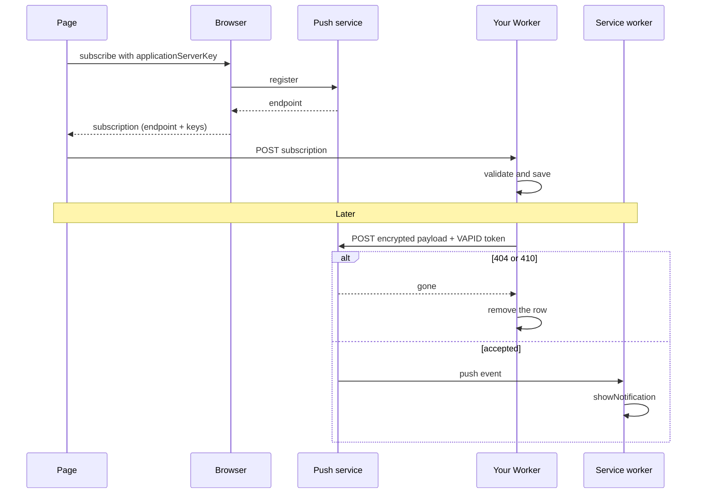

This guide lets a team member turn on alerts in their browser: a button on the settings page
subscribes this browser, the server stores the subscription, and later a failed sync shows up
as a notification even when the app is closed.

[`@sdxc/web-push`](/api/web-push) holds both halves. Its main entry encrypts a payload for one
browser (RFC 8291), signs a VAPID token for the push service (RFC 8292), sends one `POST` and
says what the answer means for the stored subscription. `@sdxc/web-push/browser` subscribes
from a click. Where subscriptions live, and when one is given up on, stay in your app.

There is no push provider to sign up for. Each browser picks its vendor's push service (Chrome
uses `fcm.googleapis.com`, Firefox `updates.push.services.mozilla.com`, Safari
`web.push.apple.com`) and hands you an endpoint on it; your Worker `POST`s there, identified
only by the key pair you generate below.

```bash
npm add @sdxc/web-push @sdxc/result @sdxc/validate remix
```

A subscription travels from the browser to your Worker once, and every notification travels
back through the browser's push service:



## Generate the sender's keys

A push service identifies a sender by one P-256 key pair. Generate it once per deployment:

```bash
bun -e 'import { WebPush } from "@sdxc/web-push"; console.log(await WebPush.generateKeys())'
```

The public key goes to every page that subscribes, so it can live in plain configuration; the
private key is a Worker secret:

```bash
cf workers secrets update VAPID_PRIVATE_KEY
```

Every browser subscription is bound to the public key it was made with, and a push service
refuses a message signed by any other. Keep the pair stable, and when it must change, rotate
it as [Rotate the keys](#rotate-the-keys) shows.

## Draw the notification in a service worker

The browser wakes your service worker with the payload. Serve it from the origin's root, so it
controls every page:

```javascript 
self.addEventListener("push", (event) => {
	let payload = event.data?.json();
	if (!payload?.title) return;

	event.waitUntil(
		self.registration.showNotification(payload.title, {
			body: payload.body,
			tag: payload.tag,
			data: { url: payload.url },
		}),
	);
});

self.addEventListener("notificationclick", (event) => {
	event.notification.close();
	event.waitUntil(self.clients.openWindow(event.notification.data?.url ?? "/"));
});
```

`tag` replaces an earlier notification with the same tag, so a recovery takes the place of
the failure it answers instead of stacking beside it.

## Subscribe from a click

Safari and Firefox show the permission prompt only during a user gesture, so `subscribe` runs
from a click. It asks for permission, registers the worker, and reuses the browser's existing
subscription or replaces one made under another key:

```tsx 
import type { Handle } from "remix/component";

import { isSuccess } from "@sdxc/result";
import { isSupported, subscribe } from "@sdxc/web-push/browser";
import { clientEntry, on } from "remix/component";

type EnablePushProps = { applicationServerKey: string; action: string };

export const EnablePush = clientEntry(
	"/app/assets/enable-push.tsx#EnablePush",
	function EnablePush(handle: Handle<EnablePushProps>) {
		async function enable() {
			let subscribed = await subscribe({
				worker: "/sw.js",
				scope: "/",
				applicationServerKey: handle.props.applicationServerKey,
			});
			if (!isSuccess(subscribed)) return;

			await fetch(handle.props.action, {
				method: "POST",
				headers: { "content-type": "application/json" },
				body: JSON.stringify({ subscription: subscribed.data }),
			});
		}

		return () => (
			<button type="button" hidden={!isSupported()} mix={[on("click", enable)]}>
				Alert me in this browser
			</button>
		);
	},
);
```

A failed `subscribe` answers `unsupported`, `denied` or `failed` and never throws. On iOS and
iPadOS, push exists only in a web app added to the Home Screen, which is when `isSupported`
answers `true`.

## Store the subscription

The endpoint in a subscription is a URL your Worker will later `POST` to, so it is untrusted
input. `SUBSCRIPTION_SCHEMA` applies the checks a send applies: a public `https:` host, a
P-256 key on the curve and a 16-byte auth secret. A row it accepts is one a send will not
refuse:

```typescript 
import { isFailure } from "@sdxc/result";
import { validate } from "@sdxc/validate";
import { SUBSCRIPTION_SCHEMA } from "@sdxc/web-push";
import * as s from "remix/data-schema";
import { createAction } from "remix/router";

import { savePushSubscription } from "~/app/data/push-subscriptions";
import routes from "~/routes/web";

const REGISTRATION = s.object({ subscription: SUBSCRIPTION_SCHEMA });

export default createAction(routes.pushSubscriptions, async (ctx) => {
	let body = await validate(ctx.request, REGISTRATION);
	if (isFailure(body)) {
		return Response.json({ errors: body.error.issues }, { status: 400 });
	}

	await savePushSubscription(ctx.db, ctx.user.id, body.data.subscription);
	return new Response(null, { status: 204 });
});
```

`savePushSubscription` is your own model function, and `ctx.user` the signed-in user your
auth middleware publishes. Upsert on the endpoint, since a browser
that subscribes again hands back the endpoint it already had, and store `endpoint`, both
`keys` and `applicationServerKey`, the public key it subscribed under.

`subscriptionSchema({ allowedHosts: PUSH_SERVICE_HOSTS })` narrows endpoints to the push
services of Chrome, Firefox, Safari and Edge, at the cost of refusing a browser whose vendor
adds a new one.

## Send a notification

Build one `WebPush` per batch of sends: it caches one VAPID token per push service, so fifty
browsers on Chrome's push service cost one signature. Each send makes one attempt and answers a `Result`
whose error code says what to do with the row:

```typescript 
import type { WebPushError } from "@sdxc/web-push";
import type { Database } from "remix/data-table";
import type { PushSubscriptionRow } from "~/app/data/push-subscriptions";

import { isFailure } from "@sdxc/result";
import { WebPush } from "@sdxc/web-push";
import { env } from "cloudflare:workers";

import Subscriptions from "~/app/data/push-subscriptions";

const FAILURE_LIMIT = 10;

export async function pushToUser(db: Database, userId: string, payload: object) {
	let push = new WebPush({
		vapid: {
			publicKey: env.VAPID_PUBLIC_KEY,
			privateKey: env.VAPID_PRIVATE_KEY,
			subject: "mailto:ops@example.com",
		},
	});

	let rows = await Subscriptions.forUser(db, userId);
	await Promise.all(
		rows.map(async (row) => {
			let sent = await push.send(
				{
					endpoint: row.endpoint,
					keys: { p256dh: row.p256dh, auth: row.auth },
					applicationServerKey: row.vapidKey ?? undefined,
				},
				JSON.stringify(payload),
				{ topic: "sync", urgency: "high" },
			);
			if (isFailure(sent)) await applyFailure(db, row, sent.error);
			else await Subscriptions.markDelivered(db, row.id);
		}),
	);
}

async function applyFailure(
	db: Database,
	row: PushSubscriptionRow,
	error: WebPushError,
) {
	if (error.code === "gone") return await Subscriptions.remove(db, row.id);
	if (!error.retryable) return;
	if (row.failures + 1 >= FAILURE_LIMIT)
		return await Subscriptions.remove(db, row.id);
	await Subscriptions.countFailure(db, row.id);
}
```

`Subscriptions` is your model over the stored rows, each holding the endpoint, both keys,
`vapidKey` and a `failures` count.

- `gone` is a `404` or `410`: the browser unsubscribed, so the row goes now.
- `unauthorized` is a `401` or `403`, which is your VAPID key being refused, never the
  browser's fault. Keep the row and fix the key.
- `invalid-vapid` is the same fault caught before any request: keys that do not form a pair,
  or a `subject` that is neither `mailto:` nor `https:`.
- `rate-limited`, `unavailable`, `timeout` and `network` are `retryable`; a run of them
  retires the row, since an endpoint refusing for days is not coming back.
- `invalid-subscription`, `invalid-options` and `payload-too-large` are answered before any
  request, so a bad row costs no network call.

A payload holds at most 3,993 bytes once encrypted into the 4,096-byte body every push service
accepts. `topic` replaces an undelivered message with the same topic, so a laptop that was
asleep all night wakes to one notification, not twenty. Errors name the push service's host
only: an endpoint plus its keys can notify that browser, so treat it like a credential.

## Send through messaging

An app that already routes alerts through [`@sdxc/messaging`](/api/messaging), as
[Send alerts to chat and paging services](/docs/data-and-background-work/messaging) shows, adds
browser push as one more destination. `BrowserPush` is an optional peer, so install
`@sdxc/web-push` beside it:

```typescript 
import type { Destination } from "@sdxc/messaging";
import type { Subscription, WebPush } from "@sdxc/web-push";

import { BrowserPush } from "@sdxc/messaging/web-push";

export function browserDestination(
	push: WebPush,
	subscription: Subscription,
): Destination {
	return new BrowserPush({ push, subscription, ttl: "1 day" });
}
```

It sends the JSON the service worker above draws: `title`, a plain-text `body` with the
message's text and fields cut to fit one push, the first link as `url`, the `key` as `tag`,
`severity` and `timestamp`. The `key` is also the push topic, and a `critical` message goes
out with high urgency. Failures arrive as `MessagingError` codes: `gone` when the browser
unsubscribed, `invalid-destination` for a subscription a send refused.

## Rotate the keys

A push service refuses a message signed by a key other than the one the browser subscribed
under, so rotating needs both keys for a while. Store each subscription's
`applicationServerKey`, then:

1. Generate a new pair, deploy it as `vapid`, and keep the old one in `previous`:

    ```typescript
    let push = new WebPush({ vapid: current, previous: [old] });
    ```

2. Pages hand the new public key to `subscribe`, which replaces a subscription made under the
   old key the next time it runs; the registration route stores the new one.
3. Once no stored row names the old key, drop it from `previous`.

A send picks the pair whose public key matches the row's `applicationServerKey`, and the
current pair for a row with none. A row naming a key the sender no longer holds fails
`invalid-subscription` before any request.

## Test without a push service

[MSW](https://mswjs.io) stands in for the push service, so the status branches run without a
network. Any `p256dh` on the P-256 curve works; RFC 8291's example key is a convenient one:

```typescript 
import { isFailure } from "@sdxc/result";
import { WebPush } from "@sdxc/web-push";
import { http, HttpResponse } from "msw";
import { setupServer } from "msw/node";
import { afterAll, afterEach, beforeAll, expect, test } from "vitest";

const ENDPOINT = "https://fcm.googleapis.com/fcm/send/device-1";

const SUBSCRIPTION = {
	endpoint: ENDPOINT,
	keys: {
		p256dh: "BCVxsr7N_eNgVRqvHtD0zTZsEc6-VV-JvLexhqUzORcxaOzi6-AYWXvTBHm4bjyPjs7Vd8pZGH6SRpkNtoIAiw4",
		auth: "BTBZMqHH6r4Tts7J_aSIgg",
	},
};

const server = setupServer();

beforeAll(() => server.listen({ onUnhandledRequest: "error" }));
afterEach(() => server.resetHandlers());
afterAll(() => server.close());

test("an unsubscribed browser answers gone", async () => {
	server.use(http.post(ENDPOINT, () => new HttpResponse(null, { status: 410 })));
	let keys = await WebPush.generateKeys();
	let push = new WebPush({ vapid: { ...keys, subject: "mailto:ops@example.com" } });

	let sent = await push.send(
		SUBSCRIPTION,
		JSON.stringify({ title: "Sync failed" }),
	);

	expect(isFailure(sent) && sent.error.code).toBe("gone");
});
```

## Where to go next

- [Send alerts to chat and paging services](/docs/data-and-background-work/messaging) — the
  delivery job, retries and fan-out that `BrowserPush` plugs into.
- [Fetch URLs a stranger chose](/docs/identity-and-security/fetch-untrusted-urls) — the public
  host rule a subscription's endpoint passes.
- [`@sdxc/web-push`](/api/web-push) — every option and error code.
