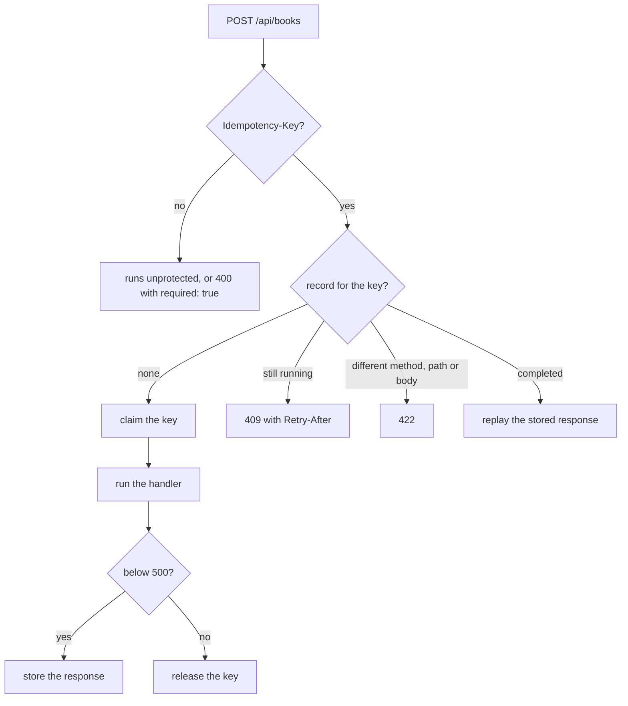

Writes fail in two quiet ways. A `POST` times out and the client cannot tell whether the book
was created, so it retries and creates a second one. Two clients read the same book, both
edit it, and the second write erases the first without anyone noticing. This guide closes
both gaps in the books API from [Build a JSON API with problem details](/docs/http-apis/json-apis).

[`@sdxc/idempotency`](/api/idempotency) replays the first outcome of a request sent again with
the same `Idempotency-Key`. [`@sdxc/merge-patch`](/api/merge-patch) reads and applies RFC 7396
patches, so an update sends only what changes. The `@sdxc/http/cache` subpath of
[`@sdxc/http`](/api/http) hands out an `ETag` and checks it back on the write.

```bash
npm add @sdxc/idempotency @sdxc/merge-patch @sdxc/http
```

## Extend the problem catalog

Both features refuse requests, and those refusals should carry your API's problem types like
every other failure. `IDEMPOTENCY_PROBLEM_ENTRIES` holds the four entries the middleware
answers with, keyed by the builder names it calls.

```typescript 
import { IDEMPOTENCY_PROBLEM_ENTRIES } from "@sdxc/idempotency";
import { defineProblems, ISSUES_SCHEMA } from "@sdxc/problem";
import * as s from "remix/data-schema";

export const problems = defineProblems("https://books.example.com/docs/errors/", {
	badRequest: {
		slug: "bad-request",
		status: 400,
		title: "The request is malformed",
	},
	notFound: {
		slug: "not-found",
		status: 404,
		title: "The resource does not exist",
	},
	validationFailed: {
		slug: "validation-failed",
		status: 422,
		title: "The request failed validation",
		extensions: s.object({ errors: ISSUES_SCHEMA }),
	},
	rateLimited: { slug: "rate-limited", status: 429, title: "Too many requests" },
	internal: {
		slug: "internal",
		status: 500,
		title: "The request failed on the server",
	},
	preconditionFailed: {
		slug: "precondition-failed",
		status: 412,
		title: "The resource changed after you read it",
	},
	unsupportedMediaType: {
		slug: "unsupported-media-type",
		status: 415,
		title: "The request body's media type is not accepted",
	},
	...IDEMPOTENCY_PROBLEM_ENTRIES,
});
```

The first five entries are the ones from the first guide. The idempotency slugs are the wire
contract clients match on, so they stay as the package defines them.

## Make create safe to retry

The middleware claims the key before the handler runs, stores the response, and answers every
later request with the same key from the store. The store needs one guarantee, an atomic
claim, and `DataTableStore` provides it with a single conditional upsert, which holds on D1 as
well as Durable Object SQLite.

```typescript 
import { DataTableStore } from "@sdxc/idempotency/data-table";
import { idempotency } from "@sdxc/idempotency/middleware";

import { problems } from "~/app/services/problems";

export const idempotent = idempotency({
	store: (ctx) => new DataTableStore(ctx.db),
	scope: (ctx) => `api-key:${ctx.apiKey.id}`,
	ttl: "24 hours",
	prefix: "books-api",
	problems,
});
```

`scope` says whose keys these are, and records never cross scopes, so one caller can never be
answered with another caller's response. It needs an identity your authentication middleware
established, shown here as `ctx.apiKey`: an unauthenticated API has nothing trustworthy to
scope on. Publish the `ttl` in your API reference, since the draft asks servers to state when
keys expire.

Create the `idempotency_keys` table by pasting `IDEMPOTENCY_KEYS_SCHEMA_SQL` into a migration,
and delete expired records from a scheduled job with `purgeExpired(db)`, as described in
[Background jobs and cron](/docs/data-and-background-work/jobs-and-cron).

Mount it on the create action only. The handler is the one from the first guide, moved
into `handler` so the action can take `middleware`:

```typescript 
import { created } from "@sdxc/http/response/json";
import { issuesFrom } from "@sdxc/problem";
import { isFailure } from "@sdxc/result";
import { validate } from "@sdxc/validate";
import { createAction } from "remix/router";

import Book, { serializeBook } from "~/app/data/book";
import { idempotent } from "~/app/http/middleware/idempotency";
import { BOOK_INPUT } from "~/app/http/schemas/books";
import { problems } from "~/app/services/problems";
import routes from "~/routes/web";

export const create = createAction(routes.api.books.create, {
	middleware: [idempotent],
	handler: async (ctx) => {
		let input = await validate(ctx.request, BOOK_INPUT);
		if (isFailure(input)) {
			let errors = issuesFrom(input.error);
			return problems.validationFailed({ extensions: { errors } });
		}

		let book = await Book.create(ctx.db, input.data);
		let location = routes.api.books.show.href({ bookId: book.id });
		return created(
			{ book: serializeBook(book) },
			{ headers: { Location: location } },
		);
	},
});
```

The rate limiter wraps every action in the first guide's `router.map`, so it runs first and
a replay still spends budget. A request without the header runs unprotected; pass
`required: true` to answer `400` instead.
The same key sent while the first request is still running gets `409` with `Retry-After`, and
the same key with a different method, path or body gets `422`. Only outcomes below `500` are
stored, so a failed write releases the key and the retry runs it.

The middleware sends each create down one of these paths:



## Send a key

A client mints the key once per operation and reuses it on every attempt:

```typescript
import { generateIdempotencyKey, withIdempotencyKey } from "@sdxc/idempotency/client";
import { unwrap } from "@sdxc/result";

let body = JSON.stringify({
	title: "Kindred",
	author: "Octavia E. Butler",
	year: 1979,
});
let headers = { "Content-Type": "application/json" };

let key = generateIdempotencyKey();
let init = unwrap(withIdempotencyKey({ method: "POST", headers, body }, key));

// Send `init` as many times as it takes: the book is created once.
await fetch("https://books.example.com/api/books", init);
```

The retries must send the same bytes, since the middleware fingerprints the method, path,
content type and body. Serialize the body once and keep it. For work retried by a queue,
`deriveIdempotencyKey(message.id, "create-book")` gives the same key on every delivery with
nothing stored.

## Hand out an ETag

A conditional write needs a validator from the read. `etag` hashes the body into a strong
tag, and `conditional` turns the response into a `304` when the client already holds it.

```typescript 
import { conditional, etag, Policies } from "@sdxc/http/cache";
import { ok } from "@sdxc/http/response/json";
import { isSuccess } from "@sdxc/result";
import { createAction } from "remix/router";

import Book, { serializeBook } from "~/app/data/book";
import { problems } from "~/app/services/problems";
import routes from "~/routes/web";

export const show = createAction(routes.api.books.show, async (ctx) => {
	let book = await Book.find(ctx.db, ctx.params.bookId);
	if (book === null) return problems.notFound({ detail: "No book has that id." });

	let body = { book: serializeBook(book) };
	let headers = new Headers({ "Cache-Control": Policies.revalidate().toString() });
	let tag = await etag(JSON.stringify(body));
	if (isSuccess(tag)) headers.set("ETag", tag.data);

	return await conditional(ctx.request, ok(body, { headers }));
});
```

`Policies.revalidate()` is `private, no-cache`: a client may store the book, but checks back
with `If-None-Match` before every reuse, and gets the body again only when it changed.

## Accept a merge patch

Add `update: patch("/api/books/:bookId")` to the route table, and `update` to the
`actions` the first guide's `application()` maps. A merge patch is written in the shape of
the resource: it lists only the members that change, and `null` removes one.

The patch applies to the book's writable members as the API spells them, with unset ones
left out, since absence is how a merge patch represents them:

```typescript 
import type { JSONObject } from "@sdxc/merge-patch";

import type { BookRow } from "~/app/data/book";

export function writableBook(book: BookRow): JSONObject {
	let target: JSONObject = {
		title: book.title,
		author: book.author,
		year: book.year,
	};
	if (book.summary !== null) target.summary = book.summary;
	return target;
}
```

The update action checks the client's tag, reads the patch, applies it to that target and
validates the result:

```typescript 
import { etag, precondition } from "@sdxc/http/cache";
import { ok } from "@sdxc/http/response/json";
import { applyValidated, MEDIA_TYPE } from "@sdxc/merge-patch";
import { readMergePatch } from "@sdxc/merge-patch/request";
import { issuesFrom } from "@sdxc/problem";
import { isFailure } from "@sdxc/result";
import { createAction } from "remix/router";

import Book, { serializeBook } from "~/app/data/book";
import { writableBook } from "~/app/http/controllers/api/books/writable-book";
import { BOOK_INPUT } from "~/app/http/schemas/books";
import { problems } from "~/app/services/problems";
import routes from "~/routes/web";

export const update = createAction(routes.api.books.update, async (ctx) => {
	let book = await Book.find(ctx.db, ctx.params.bookId);
	if (book === null) return problems.notFound({ detail: "No book has that id." });

	let tag = await etag(JSON.stringify({ book: serializeBook(book) }));
	if (isFailure(tag)) return problems.internal();
	let checked = precondition(ctx.request, { etag: tag.data });
	if (isFailure(checked)) return problems.preconditionFailed();

	let patch = await readMergePatch(ctx.request, {
		alsoAccept: ["application/json"],
	});
	if (isFailure(patch)) {
		if (patch.error.reason === "invalid-json") return problems.badRequest();
		let headers = { "Accept-Patch": MEDIA_TYPE };
		return problems.unsupportedMediaType({}, { headers });
	}

	let next = applyValidated(writableBook(book), patch.data, BOOK_INPUT);
	if (isFailure(next)) {
		let errors = issuesFrom(next.error);
		return problems.validationFailed({ extensions: { errors } });
	}

	let saved = await Book.update(ctx.db, book.id, next.data);
	return ok({ book: serializeBook(saved) });
});
```

The order is deliberate. The `404` comes before the body is read. `precondition` compares
`If-Match` with the tag the book has now: an absent header passes, and a stale tag answers
`412`, so a client that sends the tag it read cannot overwrite a change it never saw. The
check and the write are two statements, so on D1 a write can still land between them; when
that matters, make the update itself conditional in SQL.

`applyValidated` applies the patch and validates the **result** with `BOOK_INPUT`, the create
schema, so create and update share one set of limits. A patch removing `title` fails on
`/title`, and the issues point into the patched book. `alsoAccept` keeps callers that send
`application/json` working.

`Book.update` writes the validated book whole, so a removed `summary` is cleared. To write or
log only what changed, `diff(writableBook(book), next.data)` answers the smallest patch between
the two.

## Send a patch

`MergePatchOf<T>` types a patch for a resource: every member optional, and `null` allowed only
where the member itself is optional, so a patch that would remove a required field fails to
compile.

```typescript
import type { MergePatchOf } from "@sdxc/merge-patch";

import { MEDIA_TYPE, stringify } from "@sdxc/merge-patch";

interface Book {
	title: string;
	author: string;
	year: number;
	summary?: string;
}

let url = "https://books.example.com/api/books/01j9z4k2m8q7r6t5v4w3x2y1z0";
let read = await fetch(url);

let headers = new Headers({ "Content-Type": MEDIA_TYPE });
let tag = read.headers.get("ETag");
if (tag !== null) headers.set("If-Match", tag);

let patch: MergePatchOf<Book> = { year: 1979, summary: null };
await fetch(url, { method: "PATCH", headers, body: stringify(patch) });
```

`If-Match` carries the `ETag` from the `GET` the edit started from. A client holding the edited copy
instead of a patch computes one with `diff(original, edited)`, which fails before sending when
the edit sets a member to a literal `null`, something a merge patch cannot express.

To publish the update in your [OpenAPI document](/docs/http-apis/openapi), give the operation a
`body` record naming both media types, `{ "application/merge-patch+json": BOOK_PATCH,
"application/json": BOOK_PATCH }`, and list `preconditionFailed` and `unsupportedMediaType`
in its `problems`.

## Where to go next

- [Write a typed API client](/docs/http-apis/api-clients) — attach idempotency keys in one
  hook for every create.
- [Describe your API with OpenAPI](/docs/http-apis/openapi) — document the idempotency
  problems on each create.
- [Query D1 and Durable Object SQL](/docs/data-and-background-work/databases) — the
  database the store and the books table live in.
