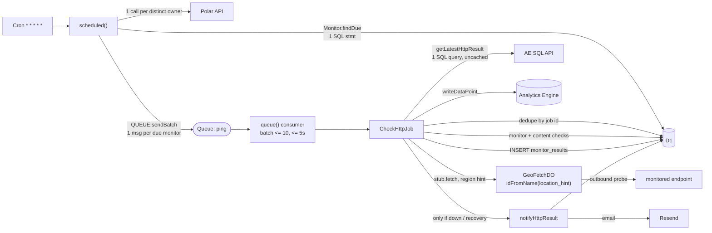
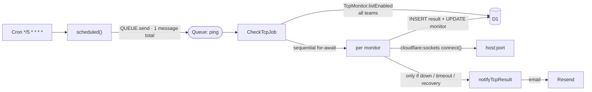
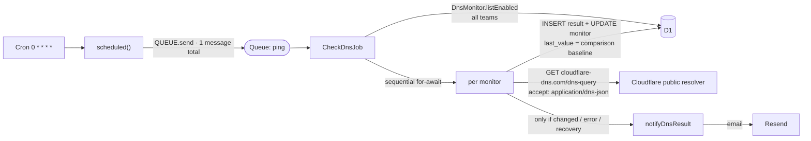
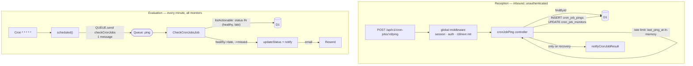

# ADR-002: Marginal Infrastructure Cost per Monitor Type and Billing-Ping Weights

## Status

**Analysis** — 2026-07-30, **partially implemented** 2026-08-02.

The email-transport recommendation has been carried out: the app sends through Cloudflare
Email Sending, and the rate card prices a sent email at $0.35 per 1,000 under
`RATE_CARD_VERSION` `2026-08-02`. Nothing else in the recommendation has been implemented.

Every email figure in the tables below is left at the $0.90 Resend rate on purpose. They
are the measurement that argued for the change, and restating them at the new price would
destroy the comparison that made the case — the point of §8 and §9 is the gap between the
two numbers. Read them as dated: costs recorded before `2026-08-02` really were priced this
way, which is what the rate-card version on each of them is for.

## Background

The product bills a flat `1 monitor execution = 1 billing ping`, at `$5/month` including
100,000 pings and `$1 per 10,000` beyond it (`app/lib/pricing.ts`). Four monitor types
share that single unit: HTTP, TCP, DNS, and cron/heartbeat. Nothing had established what
each type actually costs to execute, so it was unknown whether the flat unit is
underpricing one type, whether the included allowance is safe, and which line item breaks
first as volume grows.

This ADR traces every billable Cloudflare operation behind one execution of each type,
prices them at current published overage rates, and derives ping weights and an allowance
recommendation from the result.

## Method and scope

- Operation counts are read from the implementation at commit `889b9763`, not estimated.
- D1 row counts come from `EXPLAIN QUERY PLAN` run against the real schema, and from
  `sqlite_master` for the actual index set (including SQLite's implicit primary-key
  indexes).
- Prices are the **Workers Paid overage rates**, fetched from the official documentation
  on **2026-07-30**.
- Per the brief this analysis answers: **all included quotas are assumed exhausted**, and
  **fixed monthly plan fees are not allocated per ping**.
- Worker CPU and Durable Object duration are **not instrumented anywhere in the
  repository**. Every figure for them is a modelled band, marked as an assumption. Neither
  dominates any total, so the uncertainty is not load-bearing.
- Gross infrastructure margin excludes founder time, AI subscriptions, development cost,
  and support cost.

---

## 0. Reality check before the marginal math

Pricing everything as if quotas were exhausted is the right frame for asking _"can this
pricing survive growth?"_. It is not today's bill. Priced **with** the included quotas, the
same usage for the reference account costs:

| Metric                          | Monthly usage |       Included |    Over |      Charge |
| ------------------------------- | ------------: | -------------: | ------: | ----------: |
| Workers requests                |       242,086 |     10,000,000 |       0 |     $0.0000 |
| Workers CPU (ms)                |     1,933,996 |     30,000,000 |       0 |     $0.0000 |
| Queue operations                |     1,376,424 |      1,000,000 | 376,424 |     $0.1506 |
| D1 rows read                    | 3,504,459,872 | 25,000,000,000 |       0 |     $0.0000 |
| D1 rows written                 |     2,503,488 |     50,000,000 |       0 |     $0.0000 |
| DO requests                     |       179,304 |      1,000,000 |       0 |     $0.0000 |
| DO duration (GB-s)              |         5,603 |        400,000 |       0 |     $0.0000 |
| Analytics Engine writes         |       179,304 |     10,000,000 |       0 |     $0.0000 |
| Analytics Engine queries        |       179,334 |      1,000,000 |       0 |     $0.0000 |
| **Total marginal charge today** |               |                |         | **$0.1506** |

Only Queues is over quota. Two consequences worth holding onto:

- The largest marginal line — D1 rows read — is already consuming **14% of the 25-billion
  included allowance at five HTTP monitors**. It exhausts at roughly **35 platform-wide
  monitors on a 1-minute interval**, not 35,000. That is the line that breaks first.
- Analytics Engine is **not billed at all yet**: "Currently, you will not be billed for
  your use of Workers Analytics Engine." Its listed prices are forward-looking, so every AE
  figure below is a future liability rather than a current cost.

---

## 1. Unit prices, sources, verification date

All prices verified **2026-07-30**. No page pointed at a newer or more precise source; the
seven canonical pricing pages were themselves the most specific available.

| Service and metric                       |  Included / month |   Overage price |                Unit cost used | Source                                                                              |
| ---------------------------------------- | ----------------: | --------------: | ----------------------------: | ----------------------------------------------------------------------------------- |
| Workers requests                         |        10,000,000 |       $0.30 / M |                   $3.0 × 10⁻⁷ | [Workers pricing](https://developers.cloudflare.com/workers/platform/pricing/)      |
| Workers CPU time                         |     30,000,000 ms |    $0.02 / M ms |              $2.0 × 10⁻⁸ / ms | [Workers pricing](https://developers.cloudflare.com/workers/platform/pricing/)      |
| Queues operations                        |         1,000,000 |       $0.40 / M |                   $4.0 × 10⁻⁷ | [Queues pricing](https://developers.cloudflare.com/queues/platform/pricing/)        |
| D1 rows read                             |    25,000,000,000 |      $0.001 / M |                   $1.0 × 10⁻⁹ | [D1 pricing](https://developers.cloudflare.com/d1/platform/pricing/)                |
| D1 rows written                          |        50,000,000 |       $1.00 / M |                   $1.0 × 10⁻⁶ | [D1 pricing](https://developers.cloudflare.com/d1/platform/pricing/)                |
| D1 stored data                           |              5 GB |   $0.75 / GB-mo |                 $0.75 / GB-mo | [D1 pricing](https://developers.cloudflare.com/d1/platform/pricing/)                |
| KV keys read                             |        10,000,000 |       $0.50 / M |                   $5.0 × 10⁻⁷ | [KV pricing](https://developers.cloudflare.com/kv/platform/pricing/)                |
| KV keys written / deleted / listed       |    1,000,000 each |       $5.00 / M |                   $5.0 × 10⁻⁶ | [KV pricing](https://developers.cloudflare.com/kv/platform/pricing/)                |
| KV stored data                           |              1 GB |   $0.50 / GB-mo |                             — | [KV pricing](https://developers.cloudflare.com/kv/platform/pricing/)                |
| Durable Object requests                  |         1,000,000 |       $0.15 / M |                   $1.5 × 10⁻⁷ | [DO pricing](https://developers.cloudflare.com/durable-objects/platform/pricing/)   |
| Durable Object duration                  |      400,000 GB-s | $12.50 / M GB-s | $1.5625 × 10⁻⁹ / ms at 128 MB | [DO pricing](https://developers.cloudflare.com/durable-objects/platform/pricing/)   |
| Analytics Engine data points written     |        10,000,000 |       $0.25 / M |                   $2.5 × 10⁻⁷ | [AE pricing](https://developers.cloudflare.com/analytics/analytics-engine/pricing/) |
| Analytics Engine read queries            |         1,000,000 |       $1.00 / M |                   $1.0 × 10⁻⁶ | [AE pricing](https://developers.cloudflare.com/analytics/analytics-engine/pricing/) |
| Cloudflare Email Service — outbound      |             3,000 |   $0.35 / 1,000 |    $3.5 × 10⁻⁴ (**not used**) | [Email pricing](https://developers.cloudflare.com/email-service/platform/pricing/)  |
| Resend — outbound (**actual transport**) | 50,000 on Pro $20 |   $0.90 / 1,000 |                   $9.0 × 10⁻⁴ | [Resend pricing](https://resend.com/pricing)                                        |

### Email is Resend, not Cloudflare Email Sending

> **Superseded 2026-08-02.** This was true when measured and is no longer: the migration
> this subsection quantifies has since been made, and Resend is gone from the codebase. The
> paragraph is kept as written because the figures below depend on it.

`app/services/alerts.ts` sends through **Resend** (`resend.emails.send`; `Resend` is
registered as a container singleton in `app/lib/container.ts`). Cloudflare Email Service is
not used anywhere. Resend's marginal rate is **$0.90 per 1,000** — 2.6× Cloudflare's $0.35
per 1,000. Every email figure below is priced at the Resend rate because that is what the
code incurs; the Cloudflare rate is shown alongside as the saving available from migrating.

### Billing semantics sourced beyond the pricing pages

- **Queue consumer invocations are billed on top of queue operations.** The Queues pricing
  page is silent; [Consumer concurrency](https://developers.cloudflare.com/queues/configuration/consumer-concurrency/)
  states it: "Billing for consumers follows the Workers standard usage model meaning a
  developer is billed for the request and for CPU time used in the request."
- **Durable Object duration excludes the idle window.** DO pricing: duration is
  "wall-clock time while the Durable Object is actively running or is idle in memory but
  unable to hibernate," and "Durable Objects that are idle and eligible for hibernation are
  not billed for duration, even before the runtime has hibernated them."
  [Durable Object lifecycle](https://developers.cloudflare.com/durable-objects/concepts/durable-object-lifecycle/)
  lists the hibernation conditions, one of which is "No in-progress awaited `fetch()`."
- **Batch defaults.** [Batching and retries](https://developers.cloudflare.com/queues/configuration/batching-retries/):
  `max_batch_size` default 10 (max 100), `max_batch_timeout` default 5 s (max 60 s),
  retries default 3. `wrangler.jsonc` declares `"consumers": [{ "queue": "ping" }]` with no
  overrides, so all defaults apply and **no dead-letter queue is configured**.

### Assumptions carried through every table

- Subrequests are free ("Cloudflare does not bill for subrequests you make from your
  Worker"), so the outbound probe, the DoH lookup, the TCP connect, the Polar call, the
  Resend call, and the Analytics Engine SQL _request_ carry no Workers request charge. The
  AE SQL request is still billed as an AE read query.
- D1 "rows read" counts rows _scanned_, including via an index: "Rows read measure how many
  rows a query reads (scans)". Index writes count separately: "Indexes will add an
  additional written row when writes include the indexed column."
- Queue message bodies are far below 64 KB — the largest, `checkHttp`, is four short
  fields — so every message is exactly 1 operation per write/read/delete.

---

## 2. Architecture per monitor type

Four genuinely different topologies. The structural fact driving most of the cost
asymmetry: **only HTTP monitors are individually scheduled.** TCP, DNS, and
cron-evaluation are _sweeps_ — one queue message per fixed interval that loops over every
enabled monitor of that type, globally, in one Worker invocation.

### HTTP — per-monitor scheduling through a queue and a region-pinned Durable Object



### TCP — a single 5-minute sweep, no Durable Object



### DNS — a single hourly sweep over Cloudflare's public DoH JSON API



### Cron / heartbeat — two independent halves



**No Analytics Engine for three of the four types.** `writeHttpPingResult` is the only
`writeDataPoint` call in the codebase. DNS, TCP, and cron results are persisted **only** to
D1 result tables. That is why HTTP is the only type carrying an AE write and an AE query per
execution, and why `AggregateDailyStatsJob` reads HTTP totals from Analytics Engine but the
other three from D1 `GROUP BY` queries.

---

## 3. Billable-operation inventory

"per exec" is per monitor execution; "per sweep" is once per interval regardless of monitor
count; "per minute" is once per cron delivery.

| Operation                                 | Call site                                                   |                              HTTP |              TCP |              DNS |       Cron recv |       Cron eval |
| ----------------------------------------- | ----------------------------------------------------------- | --------------------------------: | ---------------: | ---------------: | --------------: | --------------: |
| **Workers**                               |                                                             |                                   |                  |                  |                 |                 |
| Scheduled invocation (request + CPU)      | `bootstrap/worker.ts` `scheduled()`                         |                        per minute |        per 5 min |         per hour |               — |      per minute |
| Queue consumer invocation (request + CPU) | `queue()`, batch <= 10                                      |                         per batch |        per sweep |        per sweep |               — |       per sweep |
| Inbound HTTP request (request + CPU)      | `api/cron-job-ping.ts`                                      |                                 — |                — |                — |               1 |               — |
| **Queues**                                |                                                             |                                   |                  |                  |                 |                 |
| Write (producer)                          | `QUEUE.sendBatch` / `send`                                  |                        1 per exec |      1 per sweep |      1 per sweep |               0 |    1 per minute |
| Read (delivery)                           | consumer batch                                              |                        1 per exec |      1 per sweep |      1 per sweep |               0 |    1 per minute |
| Delete (ack)                              | `Job.run` → `message.ack()`                                 |                        1 per exec |      1 per sweep |      1 per sweep |               0 |    1 per minute |
| Retry (extra read)                        | `Job.RetryError` → `message.retry()`                        |                 infra faults only |            never |            never |               — |           never |
| **D1**                                    |                                                             |                                   |                  |                  |                 |                 |
| Scheduling query                          | `Monitor.findDue`                                           | 1 stmt / minute (**full rescan**) |                — |                — |               — |               — |
| Enabled-monitor list                      | `listEnabled` / `listActionable`                            |                                 — |      1 per sweep |      1 per sweep |               — |     1 per sweep |
| Dedupe probe                              | `findOne(monitorResults, {id})`                             |                    1 per delivery |                — |                — |               — |               — |
| Monitor row load                          | `findOne(monitors, {id})`                                   |                        1 per exec |                — |                — |      1 per exec |               — |
| Content-check load                        | `findMany(monitorContentChecks)`                            |                        1 per exec |                — |                — |               — |               — |
| Result insert                             | `create(...Results)` / `create(cronJobPings)`               |                        1 per exec |       1 per exec |       1 per exec |      1 per exec |               — |
| Cached-fields update                      | `update(...Monitors)`                                       |                                 — |       1 per exec |       1 per exec |      1 per exec |   on transition |
| Retention delete                          | `CleanJob` / `CleanCronJobPingsJob`                         |                             7-day | **never purged** | **never purged** |         365-day |               — |
| Daily rollup upsert                       | `MonitorDailyStats.upsertDay`                               |                     1/monitor/day |    1/monitor/day |    1/monitor/day |   1/monitor/day |               — |
| **Durable Objects**                       |                                                             |                                   |                  |                  |                 |                 |
| Request + wall-clock duration             | `GeoFetchDO.fetch`                                          |                        1 per exec |                0 |                0 |               0 |               0 |
| **Analytics Engine**                      |                                                             |                                   |                  |                  |                 |                 |
| Data point written                        | `writeHttpPingResult`                                       |                        1 per exec |                0 |                0 |               0 |               0 |
| Read query — previous status              | `getLatestHttpResult` (**uncached**)                        |                        1 per exec |                0 |                0 |               0 |               0 |
| Read query — daily aggregate              | `getHttpDailyAggregate`                                     |                   1 / day, global |                0 |                0 |               0 |               0 |
| **KV**                                    |                                                             |                                   |                  |                  |                 |                 |
| Read / write                              | session storage; dashboard AE cache                         |                                 0 |                0 |                0 |               0 |               0 |
| **Alerting (conditional)**                |                                                             |                                   |                  |                  |                 |                 |
| Maintenance suppression query             | `MaintenanceWindow.isSuppressing`                           |                          on alert |         on alert |         on alert |     on recovery |   on transition |
| Applicable-alerts query                   | `Alert.listForHttpMonitor` / `listTeamWide` (**full scan**) |                          on alert |         on alert |         on alert |     on recovery |   on transition |
| Cooldown probe + event insert             | `AlertEvent.isInCooldown` / `.record`                       |                         per alert |        per alert |        per alert |       per alert |       per alert |
| Email send                                | `deliverEmail` → Resend                                     |                   per email alert |  per email alert |  per email alert | per email alert | per email alert |

### Two things the inventory rules out

**KV is zero on every monitor path.** KV is used for exactly two things: session storage
(`@pkg/session-storage-kv`) and the dashboard's Analytics Engine query cache.
`KVSessionStorage.read` returns an empty session _without touching KV_ when there is no
cookie, and `save` writes only when the session is dirty — so an unauthenticated `curl`
heartbeat costs 0 KV operations. Dashboard cache reads and writes scale with _page views_,
not pings.

**Polar usage reporting is not wired up.** `PING_METER_ID` and `Customer.getUsagePerMonth`
exist for reading, but `check-http.ts` says so in its own docblock — "Usage ingestion is not
wired up yet" — and there is no ingestion call anywhere. So there is no per-ping Polar
write today. There _is_ a per-owner-per-minute Polar _read_, which is a scaling risk rather
than a Cloudflare cost (see Risks).

---

## 4. Queue billing

Three operations per message is correct, for a specific reason, and the interesting
variation is elsewhere.

### Producer

Two distinct paths. `env.QUEUE.sendBatch(...)` in `scheduled()` sends **one message per due
monitor** in a single API call; the sweep and maintenance messages use `env.QUEUE.send(...)`
individually. Producer-side batching does not reduce billing: "A batch of 10 messages…would
incur 10× write, 10× read, and 10× delete operations." It is a latency and subrequest
optimisation, not a cost one.

### Operations per message

```text
write (producer)      1 op   <- QUEUE.send / sendBatch, body << 64 KB
read (delivery)       1 op   <- consumer batch delivery
delete (ack)          1 op   <- message.ack() in Job.run
                     -----
                      3 ops per successfully processed message
retry                +1 read op per redelivery (max_retries default 3)
dead-letter          +0      <- no dead_letter_queue configured; messages are dropped
```

### Consumer batching changes invocations, not operations

`max_batch_size` 10, `max_batch_timeout` 5 s, both defaults. Batching does **not** change
queue operation count (that is per message), but it does change **Workers request and CPU
count**, since a batch is one invocation. That is the only lever batch size pulls.

| Case                                | Msgs/exec | Queue ops | Consumer invocations |  Queue cost | Consumer request cost |       Total |
| ----------------------------------- | --------: | --------: | -------------------: | ----------: | --------------------: | ----------: |
| Ideal — full batches of 10, K = 1   |         1 |         3 |                 0.10 | $0.00000120 |           $0.00000003 | $0.00000123 |
| Realistic — batch ≈ 5, K = 2        |         2 |         6 |                 0.40 | $0.00000240 |           $0.00000012 | $0.00000252 |
| Worst — 1 msg per batch, K = 3      |         3 |         9 |                 3.00 | $0.00000360 |           $0.00000090 | $0.00000450 |
| Retry — 3 redeliveries then dropped |         1 |         6 |              up to 4 | $0.00000240 |           $0.00000120 | $0.00000360 |

### Average batch size for this account

Per cron minute the producer emits 4 `checkHttp` messages plus 1 `checkCronJobs`, all within
the same instant. With `max_batch_timeout` 5 s and `max_batch_size` 10 they will almost
always be delivered as **one batch of ≈ 5**. So **B ≈ 5** is the expected value used
throughout; B = 10 optimistic, B = 1 pessimistic.

### The K multiplier is a documented-in-code behaviour

`Monitor.scheduledJobId`'s docblock records that "the every-minute cron is delivered more
than once per minute with a different `scheduledTime` each time (observed ~7s apart in
production)". Each delivery independently runs `findDue`, calls Polar, and enqueues a
message per still-due monitor — so **queue operations, scheduler D1 reads, and Polar calls
all multiply by K**, while billable _pings_ do not, because the minute-bucketed job id
collides on the `monitor_results` primary key. K = 2 expected, K = 1 optimistic, K = 3
pessimistic. This is the most consequential uninstrumented number in the model.

### Retry exposure

`CheckHttpJob` only throws `Job.RetryError` for D1, Durable Object, or unexpected internal
faults. A timeout, refused connection, or wrong status code is classified into a stored
result and acked. `CheckTcpJob`, `CheckDnsJob`, and `CheckCronJobsJob` catch per-monitor
errors inside their loops and never retry. So retry cost is **zero in steady state** and
bounded by 2 extra ops per message during a D1 or DO incident. With no DLQ configured, a
message that exhausts its 3 retries is **discarded silently** — no cost, but a lost check.

---

## 5. D1 billing

### Finding 1 — `Monitor.findDue` rescans the entire results table, every minute

```text
EXPLAIN QUERY PLAN — Monitor.findDue

QUERY PLAN
|--MATERIALIZE r
|  `--SCAN monitor_results USING COVERING INDEX monitor_results_monitor_completed_at_response_status_response_time_idx
|--SCAN m
|--SEARCH t USING INDEX teams_id_unique (id=?)
`--SEARCH r USING AUTOMATIC COVERING INDEX (monitor_id=?) LEFT-JOIN
```

`MATERIALIZE r` is `EXPLAIN QUERY PLAN` reporting how it executes the existing query's
`LEFT JOIN (SELECT … GROUP BY …)` subquery — planner output, not SQL or a hint anywhere in the
codebase. The correlated subquery `SELECT monitor_id, MAX(completed_at) … GROUP BY monitor_id`
cannot be satisfied by a seek, so SQLite materialises it with a **full scan of the covering
index over every row in `monitor_results`**. `SCAN m` is a second full scan — `monitors` has
indexes on `team_id` and `created_at` but **none on `enabled_at`**, the column in the
`WHERE` clause.

> **How this plan was captured, and its limits.** Host `sqlite3` 3.51.0 against a copy of the
> local D1 database file, which carries the real schema and index set. D1 runs its own SQLite
> build, so the exact plan text and the planner's choices may differ in production. The
> planner-independent part of the claim: `MAX(completed_at) … GROUP BY monitor_id` over an
> unfiltered table must read every row of it, by any strategy. Confirm with
> `wrangler d1 execute DB --remote --command "EXPLAIN QUERY PLAN …"`, and treat `meta.rows_read`
> from a real response as the authoritative number (§16). Every row count in this ADR that came
> from a query plan carries the same caveat.

`monitor_results` holds 7 days of history (`CleanJob`'s `RETENTION_MS`), which makes the
per-ping cost independent of scale:

```text
Let P    = platform HTTP pings per month
    K    = every-minute cron deliveries per minute
    Nm   = rows in `monitors`
    Nres = rows in `monitor_results` = 7 x (P / 30)

rows read per delivery  = Nres + 3*Nm
deliveries per month    = 43,200 x K

rows read per month     = 43,200*K*(7P/30 + 3*Nm)

rows read PER PING      = 43,200*K*7/30  +  43,200*K*3*Nm/P
                        = 10,080*K       +  129,600*K*Nm/P
                          ^^^^^^^^
                          scale-invariant — does not shrink with volume

At K = 2, Nm = 5, P = 179,304:  20,160 + 7 = 20,167 rows read per ping
                                            = $0.0000202 per ping
                                            = $0.202 per 10,000 pings
                                            = 20% of the $1/10,000 price
```

**This one query is 58% of expected HTTP cost** — not 58% of the D1 line, 58% of the entire
per-ping cost, and 97% of D1 rows read. It is also entirely an implementation artifact: the
information it recomputes (when is this monitor next due) is derivable in O(1) from a column
on `monitors`.

### Finding 2 — every result table carries a redundant duplicate index

Each table declares `id text(36) PRIMARY KEY NOT NULL`, which SQLite implements with an
automatic unique index, _and_ the migrations then create an explicit `*_id_unique` index on
the same column. Confirmed against `sqlite_master`:

```text
monitor_results        -> sqlite_autoindex_monitor_results_1        + monitor_results_id_unique
cron_job_pings         -> sqlite_autoindex_cron_job_pings_1         + cron_job_pings_id_unique
dns_monitor_results    -> sqlite_autoindex_dns_monitor_results_1    + dns_monitor_results_id_unique
tcp_monitor_results    -> sqlite_autoindex_tcp_monitor_results_1    + tcp_monitor_results_id_unique
cron_job_monitors      -> sqlite_autoindex_cron_job_monitors_1      + cron_job_monitors_id_unique
monitor_daily_stats    -> sqlite_autoindex_monitor_daily_stats_1    (no duplicate)
```

Each duplicate adds **one row written per insert and one per delete**, for no query benefit
— nothing can use it that the primary key index cannot. At $1.00/M rows written that is
$0.000002 per HTTP ping wasted (insert + eventual delete), or **6% of expected HTTP cost**
and **17% of TCP/DNS cost**.

### Rows written per statement, derived from the real index set

Rows written = 1 table row + 1 per index whose columns the write touches.

| Statement                              | Indexes touched                                                  | Rows written |
| -------------------------------------- | ---------------------------------------------------------------- | -----------: |
| `INSERT monitor_results`               | autoindex, `id_unique`, `created_at_idx`, 4-col composite        |            5 |
| `DELETE monitor_results` (CleanJob)    | same four                                                        |            5 |
| `INSERT cron_job_pings`                | autoindex, `id_unique`, `created_at_idx`, `cron_job_monitor_idx` |            5 |
| `DELETE cron_job_pings` (365 d)        | same four                                                        |            5 |
| `INSERT dns_monitor_results`           | autoindex, `id_unique`, `checked_at_idx`, `dns_monitor_idx`      |            5 |
| `INSERT tcp_monitor_results`           | autoindex, `id_unique`, `checked_at_idx`, `tcp_monitor_idx`      |            5 |
| `UPDATE cron_job_monitors` (ping)      | `status_next_expected_idx` — both columns change                 |            2 |
| `UPDATE dns_monitors` / `tcp_monitors` | none — no updated column is indexed                              |            1 |
| `INSERT alert_events`                  | autoindex + 4 explicit indexes                                   |            6 |
| `INSERT monitor_daily_stats`           | autoindex, `date_idx`, `monitor_type_date_idx`                   |            4 |

`db.create(..., { returnRow: true })` and `db.update(...)` each compile to exactly **one**
statement — `INSERT … RETURNING *` and `UPDATE … RETURNING *` — because the D1 adapter
advertises `capabilities.returning: true`. No read-after-write round trip. Note also that
the adapter's docblock is explicit that **D1 transactions are not atomic**: "it therefore
tracks transaction tokens logically and runs each statement immediately." Nothing in the
monitor paths relies on multi-statement atomicity, but the result insert and the
cached-fields update in `recordCheckResult` can diverge on a mid-call failure.

### Queries whose cost grows with the result tables

| Query                                          | Plan                                                                              | Grows with                                                     | Severity |
| ---------------------------------------------- | --------------------------------------------------------------------------------- | -------------------------------------------------------------- | -------- |
| `Monitor.findDue`                              | `MATERIALIZE` + full index scan + `SCAN m`                                        | 7 days × platform HTTP ping rate, re-read 43,200×K times/month | critical |
| `Alert.listForHttpMonitor` / `listTeamWide`    | `SCAN alerts` — no index on `team_id`; the `OR … IS NULL` would defeat one anyway | total alerts across all tenants, per non-healthy result        | high     |
| `CleanJob`'s `DELETE … WHERE completed_at < ?` | full scan — no index on `completed_at` alone                                      | `monitor_results` size, once daily                             | low      |
| `Monitor.countConsumedPingsByTeam`             | 8 correlated sub-counts in one statement                                          | 2 days of 4 result tables, per dashboard view                  | medium   |
| `Monitor.getStats`                             | second statement orders _every_ matching `response_time_ms` to compute p99 in JS  | unbounded — no `LIMIT`, no time window                         | high     |
| `aggregateD1` over `dns_/tcp_monitor_results`  | `GROUP BY` over a table with **no retention job at all**                          | forever                                                        | high     |

Indexed point lookups are counted at 2 rows read (one index entry, one table row); an
indexed miss at 1. Those ±1 assumptions are the least certain numbers here and the easiest
to verify — `meta.rows_read` comes back on every D1 response.

---

## 6. Durable Object billing

One Durable Object class, `GeoFetchDO`, used by HTTP monitors only. It exists to measure
response time from a chosen region: `idFromName(monitor.location_hint)`,
`get(id, { locationHint })`.

| Question                                               | Answer, from the code and the docs                                                                                                                                                                                                                         |
| ------------------------------------------------------ | ---------------------------------------------------------------------------------------------------------------------------------------------------------------------------------------------------------------------------------------------------------- |
| Requests per HTTP execution                            | 1 — a single `stub.fetch`                                                                                                                                                                                                                                  |
| Configured memory                                      | 128 MB, not configurable. "Duration billing charges for the 128 MB of memory your Durable Object is allocated, regardless of actual usage."                                                                                                                |
| Is outbound network waiting billed as active duration? | **Yes.** Hibernation requires "No in-progress awaited `fetch()`", and duration is billed whenever the object is not hibernation-eligible. The probe's wall-clock time is billed.                                                                           |
| Does it remain billed after returning?                 | **No.** No WebSockets, alarms, storage, timers, or outbound sockets — so it is hibernation-eligible the instant the response completes, and idle hibernation-eligible objects "are not billed for duration". The 10-second pre-hibernation window is free. |
| Multiple operations per request?                       | No — one proxied fetch, two header writes, one `performance.now()` delta.                                                                                                                                                                                  |
| Alarms?                                                | None anywhere in the codebase.                                                                                                                                                                                                                             |
| Hibernation API?                                       | Not used, and not needed — no WebSockets to hibernate.                                                                                                                                                                                                     |
| Is duration instrumented?                              | **No.** `X-Response-Time` measures the _probe_, not the object's billed window, and it is discarded after being read into `response_time_ms`.                                                                                                              |

Duration scenarios — uninstrumented, so these are modelled bands:

| Scenario                                 | Billed wall clock |    GB-s | Duration cost | + 1 request |     Total DO |
| ---------------------------------------- | ----------------: | ------: | ------------: | ----------: | -----------: |
| Fast — local, warm, HEAD                 |             50 ms | 0.00625 |  $0.000000078 | $0.00000015 | $0.000000228 |
| Typical — cross-region HEAD              |            250 ms | 0.03125 |  $0.000000391 | $0.00000015 | $0.000000541 |
| Slow — GET with body for content checks  |          1,000 ms |   0.125 |  $0.000001563 | $0.00000015 | $0.000001713 |
| Timeout — `timeout_seconds` default 10   |         10,000 ms |    1.25 |  $0.000015625 | $0.00000015 | $0.000015775 |
| Timeout at the maximum plausible setting |         30,000 ms |    3.75 |  $0.000046875 | $0.00000015 | $0.000047025 |

**Concurrency makes DO duration cheaper than it looks — and creates a bottleneck.** Because
the DO id derives _only_ from the location hint, **every monitor in a region, across every
tenant, shares one object instance**. Duration is per-object wall clock, so four monitors
probing concurrently through the same object over a 250 ms window cost 250 ms of duration in
total, not 1,000 ms — per-ping duration cost falls as regional density rises. The same
sharing is a throughput ceiling and a blast radius: all default-region traffic funnels
through `idFromName("wnam")`.

**TCP and DNS use no Durable Object at all.** `checkTcpConnection` calls `connect()` from
`cloudflare:sockets` directly inside the queue consumer Worker; `resolveDns` calls `fetch()`
against the public DoH endpoint. So the answer to "do TCP checks consume more DO duration
than HTTP" is: they consume **none**. Nor more Worker CPU — the TCP path is a socket open
plus one insert and one update, materially less work than the HTTP path's schema validation,
content-check evaluation, and AE query. Waiting on a socket is wall-clock, and Workers
Standard has "No charge or limit for duration."

---

## 7. Workers, KV, and Analytics Engine

### Workers invocations attributable to monitor activity — reference account, K = 2

| Invocation type               | Trigger                         | Count / month | Scales with               |
| ----------------------------- | ------------------------------- | ------------: | ------------------------- |
| Scheduled — every minute      | `* * * * *`                     |        86,400 | per scheduled job × K     |
| Scheduled — other five crons  | 5 m, 10 m, 1 h, 2× daily, daily |        13,608 | per scheduled job         |
| Queue consumer batches        | queue delivery, B ≈ 5           |      ≈ 87,000 | per result ÷ batch size   |
| Cron heartbeat POSTs          | inbound HTTP                    |        58,924 | per result                |
| Dashboard / status-page views | inbound HTTP                    | assumed 5,000 | per account, not per ping |

Frame fragments do **not** add requests: `resolveFrame` in `bootstrap/app.tsx` calls
`router.fetch(...)` in-process, so a dashboard load with five frames is one billable
request, not six.

**CPU is not instrumented anywhere**, so all CPU figures are bands. The largest single
per-request CPU item is not in any monitor job — it is the i18n middleware.
`@pkg/i18n/middleware` calls `createInstance()` and `await instance.init({ resources })` _on
every request_, with all six locale bundles attached (**614 KB** of translation source
across `app/locales/*.ts`). The unauthenticated cron heartbeat endpoint pays that to return
two JSON fields. That is why the heartbeat CPU band (3 / 8 / 20 ms) is wider and higher than
the check jobs' (1 / 3 / 8 ms). Even at 20 ms it is $0.0000004 per heartbeat — real but not
decisive.

### KV

Zero operations on every monitor execution path. KV operations occur only:

- on authenticated page loads — 1 session read, plus 1 write if the session is dirtied;
- on dashboard cache miss — `queryAnalyticsCached` does 1 read, then on a miss 1 AE query
  and 1 write, with a 60-second TTL from `getCacheTtl`;
- never during check execution, alerting, or configuration changes.

KV storage growth is bounded by session count and two cache keys per team. Not material.

### Analytics Engine

| Operation                   | Origin                                                                                                   | Data points / query | Frequency                                      |
| --------------------------- | -------------------------------------------------------------------------------------------------------- | ------------------: | ---------------------------------------------- |
| Write — 1 data point        | `writeHttpPingResult`: 3 blobs, 4 doubles, 1 index                                                       |             1 write | 1 per HTTP execution. Zero for TCP, DNS, cron. |
| Query — alerting            | `getLatestHttpResult` from `CheckHttpJob`                                                                |             1 query | **1 per HTTP execution, uncached**             |
| Query — aggregation         | `getHttpDailyAggregate`                                                                                  |             1 query | 1 per day, platform-wide                       |
| Query — dashboard, cached   | `getTeamHttpSummaries`, `getTeamHttpSparklines`                                                          |    1 query per miss | <= 1 per 60 s per team per segment             |
| Query — dashboard, uncached | `getSlowestResultForMonitor`; **`getLatestHttpResult` mapped over every monitor** in `http-monitors.tsx` |           N queries | N per monitors-list page view — an N+1         |
| Query — usage metering      | none — metering reads D1, not AE                                                                         |                   0 | —                                              |

Allocating the daily aggregate query back across results: 1 query ÷ (P/30) results per day =
**30/P per ping**, or $1.7 × 10⁻¹⁰ at the reference volume. Negligible. The per-execution
alerting query is the one that matters: at $1.00 per million queries it is **$0.000001 per
ping — 3% of expected HTTP cost**, spent to learn something the job could have read from a
column it is already writing.

---

## 8. Email

Email is never sent on a healthy result. `notifyHttpResult` returns before any I/O when
`status === "up"` and the previous status was not worse; the DNS, TCP, and cron equivalents
do the same. So the base ping cost in every table below contains **zero** email.

| Recipients notified | Resend (actual) | Cloudflare Email (if migrated) |    Saving |
| ------------------- | --------------: | -----------------------------: | --------: |
| 1                   |       $0.000900 |                      $0.000350 | $0.000550 |
| 5                   |       $0.004500 |                      $0.001750 | $0.002750 |
| 10                  |       $0.009000 |                      $0.003500 | $0.005500 |
| 100                 |       $0.090000 |                      $0.035000 | $0.055000 |
| 1,000               |       $0.900000 |                      $0.350000 | $0.550000 |

Multi-recipient fan-out is per _alert record_, not per address: an email alert's config is a
single `to` string, so N recipients means N alert rows, and `dispatchAlerts` runs them
through `Promise.allSettled` — N emails, N cooldown probes, N `alert_events` inserts at 6
rows written each. The D1 cost of notifying 1,000 recipients is 6,000 rows written ($0.006)
on top of $0.90 of email.

### The default cooldown is zero, and nothing else bounds repetition

`alerts.cooldown_minutes` defaults to `0`, commented in the schema as `// 0 = no cooldown`.
`AlertEvent.isInCooldown` returns `false` immediately when the value is <= 0. Down alerts
are **not edge-triggered** — `notifyHttpResult` dispatches on _every_ non-healthy result,
relying on cooldown to prevent spam. With the default, a 1-minute monitor that is down sends
**one email per minute, indefinitely**.

| Outage length | `cooldown_minutes` | Emails |  Resend | Cloudflare Email | Verdict                            |
| ------------- | ------------------ | -----: | ------: | ---------------: | ---------------------------------- |
| 30 minutes    | **0 — default**    |     31 | $0.0279 |          $0.0109 | tolerable                          |
| 30 minutes    | 15                 |      3 | $0.0027 |          $0.0011 | 10× cheaper                        |
| 30 minutes    | 60                 |      2 | $0.0018 |          $0.0007 | —                                  |
| 24 hours      | **0 — default**    |  1,441 | $1.2969 |          $0.5044 | 26% of monthly revenue             |
| 7 days        | **0 — default**    | 10,081 | $9.0729 |          $3.5284 | **exceeds the whole subscription** |

Other email-generating paths:

- **Recovery** — one email per alert with `notify_on_recovery` (default `true`). A
  down-and-recovery incident is therefore _down-emails + 1_.
- **Cron late/missed** — `CheckCronJobsJob` alerts on `healthy -> late` and again on
  `… -> missed`, so a silent job produces **two** notifications, then stops
  (`listActionable` excludes `missed`). Bounded, unlike the HTTP path.
- **SSL** — `notifySslResult` is deliberately _not_ edge-triggered: it fires every day
  `shouldAlertOnSslStatus` says to, "repeated reminders, not a one-time transition,"
  bounded only by per-alert cooldown — which defaults to 0. A monitor left in `expiring`
  for 30 days sends 30 emails per alert.
- **Status-page subscribers** — not implemented. There is no subscriber table and no
  status-page notification path, so this cost is zero today.
- **Duplicate prevention** — the only mechanism is `cooldown_minutes`. Delivery failures
  are recorded to `alert_events` with `status: "failed"` and **never retried**, so there is
  no retry amplification.

---

## 9. Cost tables per scenario

Every table is per **one monitor execution**, fully allocated: the execution's own
operations, its share of the scheduler or sweep that dispatched it, and its share of the
retention and aggregation work it will later cause.

### Scenario definitions

| Parameter                                            | Optimistic | Expected                 | Pessimistic                          |
| ---------------------------------------------------- | ---------- | ------------------------ | ------------------------------------ |
| K — every-minute cron deliveries per minute          | 1          | 2                        | 3                                    |
| Monitors due per cron minute (scheduler denominator) | 20         | 4                        | 1                                    |
| B — queue messages per consumer batch                | 10         | 5                        | 1                                    |
| Monitors of the swept type, globally                 | 20         | 5                        | 1                                    |
| Worker CPU per check job (**assumption**)            | 1 ms       | 3 ms                     | 8 ms                                 |
| DO billed wall clock (**assumption**)                | 50 ms      | 250 ms                   | 1,000 ms                             |
| Duplicate delivery outcome                           | n/a        | short-circuits on job id | **races** — probes and queries twice |
| Rows in `alerts`, globally (full-scan target)        | 10         | 10                       | 10                                   |

### HTTP success

| Service                 | Usage per execution (opt / exp / pes) |       Optimistic |         Expected |      Pessimistic |
| ----------------------- | ------------------------------------- | ---------------: | ---------------: | ---------------: |
| Workers requests        | 0.15 / 0.90 / 6                       |     $0.000000045 |     $0.000000270 |     $0.000001800 |
| Workers CPU             | 1.1 / 6 / 60 ms                       |     $0.000000022 |     $0.000000120 |     $0.000001200 |
| Queue operations        | 3 / 6 / 9                             |     $0.000001200 |     $0.000002400 |     $0.000003600 |
| D1 rows read            | 10,095 / 20,180 / 30,266              |     $0.000010095 |     $0.000020180 |     $0.000030266 |
| D1 rows written         | 10 / 10 / 10                          |     $0.000010006 |     $0.000010006 |     $0.000010006 |
| KV operations           | 0 / 0 / 0                             |               $0 |               $0 |               $0 |
| DO requests             | 1 / 1 / 3                             |     $0.000000150 |     $0.000000150 |     $0.000000450 |
| DO duration @ 128 MB    | 50 / 250 / 3,000 ms                   |     $0.000000078 |     $0.000000391 |     $0.000004688 |
| AE writes               | 1 / 1 / 1                             |     $0.000000250 |     $0.000000250 |     $0.000000250 |
| AE queries              | 1 / 1 / 3                             |     $0.000001000 |     $0.000001000 |     $0.000003000 |
| Email sends             | 0 / 0 / 0                             |               $0 |               $0 |               $0 |
| **Total per execution** |                                       | **$0.000022845** | **$0.000034767** | **$0.000055259** |
| Per 10,000              |                                       |          $0.2285 |          $0.3477 |          $0.5526 |

### HTTP failure — down

The added work is alert _evaluation_, which happens even when no alert is configured: a
maintenance-window lookup and the `alerts` full scan run before anything is delivered.

| Service                            | Usage (exp)                                                    |     No alert configured |           1 email alert |            Delta |
| ---------------------------------- | -------------------------------------------------------------- | ----------------------: | ----------------------: | ---------------: |
| Workers requests                   | 0.90                                                           |            $0.000000270 |            $0.000000270 |                — |
| Workers CPU                        | 7 / 7.5 ms                                                     |            $0.000000140 |            $0.000000150 |     $0.000000010 |
| Queue operations                   | 6                                                              |            $0.000002400 |            $0.000002400 |                — |
| D1 rows read                       | 20,192 / 20,193 (+2 maintenance, +10 alerts scan, +1 cooldown) |            $0.000020192 |            $0.000020193 |     $0.000000001 |
| D1 rows written                    | 10 / 16 (+6 alert_events)                                      |            $0.000010006 |            $0.000016006 |     $0.000006000 |
| DO requests + duration             | 1 · 250 ms                                                     |            $0.000000541 |            $0.000000541 |                — |
| AE writes + queries                | 1 + 1                                                          |            $0.000001250 |            $0.000001250 |                — |
| Email sends                        | 0 / 1                                                          |                      $0 |            $0.000900000 |     $0.000900000 |
| **Total per execution (expected)** |                                                                |        **$0.000034799** |        **$0.000940810** | **$0.000906011** |
| Per 10,000                         |                                                                |                 $0.3480 |                 $9.4081 |          $9.0601 |
| Optimistic / pessimistic total     |                                                                | $0.0000229 / $0.0000553 | $0.0009289 / $0.0009613 |                  |

**A down check without an email alert costs 0.1% more than a successful one.** Email is 96%
of an alerting down-check. Every conclusion about failure cost is really a conclusion about
email volume.

### HTTP timeout

Distinct from a plain failure in exactly one line: `AbortSignal.timeout(monitor.timeout_seconds * 1000)`
holds the Durable Object active for the whole window. Everything else — classification as
`down` via `UNREACHABLE`, the insert, the alert path — is identical.

| Service                       | Usage (exp)                        |       Optimistic |         Expected | Pessimistic (30 s timeout) |
| ----------------------------- | ---------------------------------- | ---------------: | ---------------: | -------------------------: |
| Everything except DO duration | as HTTP failure + 1 email          |     $0.000928810 |     $0.000940419 |               $0.000956615 |
| DO duration                   | **10,000 ms** (30,000 pessimistic) |     $0.000015625 |     $0.000015625 |               $0.000046875 |
| **Total per execution**       |                                    | **$0.000944435** | **$0.000956044** |           **$0.001003490** |
| Per 10,000                    |                                    |          $9.4444 |          $9.5604 |                   $10.0349 |
| Without email, for comparison |                                    |       $0.0000385 |       $0.0000504 |                 $0.0001035 |

A timeout costs **40× the DO duration** of a typical success ($0.0000156 vs $0.0000004) —
noticeable in isolation, but still under a third of the email that usually accompanies it.
Without email, a timeout is 1.45× a success.

### Content checks and response-body processing

Not a separate scenario, but a cost multiplier. When a monitor has enabled content checks,
`CheckHttpJob` (a) rewrites `HEAD` to `GET`, (b) calls `await response.text()`, streaming
the body through the Durable Object, and (c) runs `ContentCheck.evaluate` — which, for
`type: "regex"`, compiles and executes a user-supplied pattern against the body. Effects: DO
duration rises from the "typical" band to the "slow" band or beyond, Worker CPU rises with
body size, and the regex is an unbounded CPU sink on a large body. Content checks also change
the D1 read count by 1 -> N (the number of enabled checks). Expected extra cost at a 100 KB
body and 1,000 ms DO duration: **+$0.0000013 per execution, ≈ +4%**.

### TCP — success, and failure/timeout

Success and timeout are **merged**: the infrastructure cost is identical.
`checkTcpConnection` writes the same one result row and one monitor update either way, uses
no Durable Object, and its `Promise.race` against `setTimeout(timeoutMs)` consumes wall
clock, which Workers Standard does not bill. Failure differs from success only by the alert
path.

| Service                 | Usage (opt / exp / pes) |    Success — opt |    Success — exp |    Success — pes | Down/timeout + 1 email (exp) |
| ----------------------- | ----------------------- | ---------------: | ---------------: | ---------------: | ---------------------------: |
| Workers requests        | 0.06 / 0.24 / 2         |     $0.000000016 |     $0.000000072 |     $0.000000600 |                 $0.000000072 |
| Workers CPU             | 1.55 / 1.7 / 2.5 ms     |     $0.000000031 |     $0.000000034 |     $0.000000050 |                 $0.000000064 |
| Queue operations        | 0.15 / 0.60 / 3         |     $0.000000060 |     $0.000000240 |     $0.000001200 |                 $0.000000240 |
| D1 rows read            | 2 / 2 / 2 (15 on alert) |     $0.000000002 |     $0.000000002 |     $0.000000002 |                 $0.000000015 |
| D1 rows written         | 6 / 6 / 6 (12 on alert) |     $0.000006001 |     $0.000006001 |     $0.000006001 |                 $0.000012001 |
| KV · DO · AE            | 0 across the board      |               $0 |               $0 |               $0 |                           $0 |
| Email sends             | 0 / 0 / 0 (1 on alert)  |               $0 |               $0 |               $0 |                 $0.000900000 |
| **Total per execution** |                         | **$0.000006110** | **$0.000006349** | **$0.000007853** |             **$0.000912392** |
| Per 10,000              |                         |          $0.0611 |          $0.0635 |          $0.0785 |                      $9.1239 |

**94% of a TCP execution's cost is six D1 rows written.** Four of those six are the
result-row insert's indexes, one of which is the redundant duplicate.

### DNS — success and failure

Resolution is an **outbound DNS-over-HTTPS request** to `https://cloudflare-dns.com/dns-query`
with `accept: application/dns-json` — Cloudflare's public resolver, not a platform DNS
binding and not a third-party resolver. `dns-check.ts`'s docblock explains why: "Workers have
no raw DNS socket access." It is a free subrequest against a free public endpoint, so **no
external resolver cost applies**.

| Service                 | Usage (opt / exp / pes) |    Success — opt |    Success — exp |    Success — pes | Changed/error + 1 email (exp) |
| ----------------------- | ----------------------- | ---------------: | ---------------: | ---------------: | ----------------------------: |
| Workers requests        | 0.06 / 0.24 / 2         |     $0.000000016 |     $0.000000072 |     $0.000000600 |                  $0.000000072 |
| Workers CPU             | 2.05 / 2.2 / 3 ms       |     $0.000000041 |     $0.000000044 |     $0.000000060 |                  $0.000000074 |
| Queue operations        | 0.15 / 0.60 / 3         |     $0.000000060 |     $0.000000240 |     $0.000001200 |                  $0.000000240 |
| D1 rows read            | 2 / 2 / 2 (15 on alert) |     $0.000000002 |     $0.000000002 |     $0.000000002 |                  $0.000000015 |
| D1 rows written         | 6 / 6 / 6 (12 on alert) |     $0.000006011 |     $0.000006011 |     $0.000006011 |                  $0.000012011 |
| DoH resolution request  | 1 free subrequest       |               $0 |               $0 |               $0 |                            $0 |
| KV · DO · AE            | 0 across the board      |               $0 |               $0 |               $0 |                            $0 |
| Email sends             | 0 / 0 / 0 (1 on alert)  |               $0 |               $0 |               $0 |                  $0.000900000 |
| **Total per execution** |                         | **$0.000006131** | **$0.000006369** | **$0.000007873** |              **$0.000912412** |
| Per 10,000              |                         |          $0.0613 |          $0.0637 |          $0.0787 |                       $9.1241 |

A DNS _error_ is marginally cheaper than a success on the resolution side — `checkDns`
catches the throw and returns `status: "error"` with `responseTimeMs: 0`, skipping answer
normalisation — but it then triggers the alert path. The difference is under $0.00000001 and
the two are merged.

### Cron — the three sub-scenarios

| Service          | Heartbeat received (opt / exp / pes)          |   Received — opt |   Received — exp |   Received — pes | One evaluation (exp) | Missed transition + 1 email (exp) |
| ---------------- | --------------------------------------------- | ---------------: | ---------------: | ---------------: | -------------------: | --------------------------------: |
| Workers requests | 1 inbound POST                                |     $0.000000300 |     $0.000000300 |     $0.000000300 |         $0.000000013 |                      $0.000000013 |
| Workers CPU      | 3 / 8 / 20 ms (i18next init dominates)        |     $0.000000060 |     $0.000000160 |     $0.000000400 |         $0.000000009 |                      $0.000000059 |
| Token validation | **none** — route is unauthenticated by design |               $0 |               $0 |               $0 |                   $0 |                                $0 |
| Queue operations | 0                                             |               $0 |               $0 |               $0 |         $0.000000267 |                      $0.000000267 |
| D1 rows read     | 2                                             |     $0.000000002 |     $0.000000002 |     $0.000000002 |         $0.000000004 |                      $0.000000017 |
| D1 rows written  | 12 (5 insert + 2 update + 5 deferred delete)  |     $0.000012006 |     $0.000012006 |     $0.000012006 |                   $0 |                      $0.000008000 |
| KV · DO · AE     | 0 across the board                            |               $0 |               $0 |               $0 |                   $0 |                                $0 |
| Email sends      | 0 — only on a genuine recovery                |               $0 |               $0 |               $0 |                   $0 |                      $0.000900000 |
| **Total**        |                                               | **$0.000012368** | **$0.000012468** | **$0.000012708** |     **$0.000000293** |                  **$0.000908356** |
| Per 10,000       |                                               |          $0.1237 |          $0.1247 |          $0.1271 |              $0.0029 |                           $9.0836 |

#### What counts as one cron ping?

Read from the code, not assumed. `Monitor.countConsumedPingsByTeam` counts
`SELECT COUNT(*) FROM cron_job_pings` — i.e. **received heartbeats**.
`Monitor.estimateConsumedPingsByTeam` projects **scheduled cron occurrences** by walking the
expression with `cron-parser`. Scheduled evaluations are counted by neither.

```text
Billable cron ping  =  one received heartbeat            (counted figure)
                    ~= one expected heartbeat occurrence (projected figure)
Evaluation sweeps   =  not billed as pings at all
```

Because both halves consume infrastructure, the combined cost per billable ping depends on
how often the job pings — the sweep runs every minute regardless:

| Job schedule    | Evaluations per heartbeat |   Optimistic |     Expected |  Pessimistic |
| --------------- | ------------------------: | -----------: | -----------: | -----------: |
| Every minute    |                         1 | $0.000012434 | $0.000012760 | $0.000017307 |
| Every 5 minutes |                         5 | $0.000012698 | $0.000013931 | $0.000035703 |
| Hourly          |                        60 | $0.000016328 | $0.000030028 | $0.000288648 |
| Daily           |                     1,440 | $0.000107408 | $0.000433908 | $0.006635268 |

**Do not over-read the daily row.** The absolute cost of the evaluation sweep is
**$0.06–$0.20 per month, platform-wide, for any number of cron monitors** — it is a fixed
background job, and its D1 read cost is an indexed seek on
`cron_job_monitors_status_next_expected_idx`. Dividing that fixed cost by a small heartbeat
count produces a large per-ping figure that says more about the denominator than the cost.
The honest classification: reception scales _per result_; evaluation scales _per scheduled
job_ and should not be allocated per ping. The correct pricing response to an
infrequently-pinging cron monitor is a per-monitor floor, not a ping weight.

---

## 10. Cost at volume

| Monitor type            | Scenario    |         1 |     1,000 |    10,000 |   100,000 |    500,000 |  1,000,000 |
| ----------------------- | ----------- | --------: | --------: | --------: | --------: | ---------: | ---------: |
| HTTP                    | optimistic  | $0.000023 | $0.022845 | $0.228455 | $2.284546 | $11.422732 | $22.845463 |
| HTTP                    | expected    | $0.000035 | $0.034767 | $0.347666 | $3.476658 | $17.383289 | $34.766577 |
| HTTP                    | pessimistic | $0.000055 | $0.055259 | $0.552591 | $5.525907 | $27.629533 | $55.259066 |
| TCP                     | optimistic  | $0.000006 | $0.006110 | $0.061104 | $0.611043 |  $3.055215 |  $6.110429 |
| TCP                     | expected    | $0.000006 | $0.006349 | $0.063489 | $0.634893 |  $3.174465 |  $6.348929 |
| TCP                     | pessimistic | $0.000008 | $0.007853 | $0.078529 | $0.785293 |  $3.926465 |  $7.852929 |
| DNS                     | optimistic  | $0.000006 | $0.006131 | $0.061306 | $0.613061 |  $3.065306 |  $6.130612 |
| DNS                     | expected    | $0.000006 | $0.006369 | $0.063691 | $0.636911 |  $3.184556 |  $6.369112 |
| DNS                     | pessimistic | $0.000008 | $0.007873 | $0.078731 | $0.787311 |  $3.936556 |  $7.873112 |
| Cron (every-minute job) | optimistic  | $0.000012 | $0.012434 | $0.124336 | $1.243356 |  $6.216778 | $12.433556 |
| Cron (every-minute job) | expected    | $0.000013 | $0.012760 | $0.127602 | $1.276022 |  $6.380111 | $12.760223 |
| Cron (every-minute job) | pessimistic | $0.000017 | $0.017307 | $0.173066 | $1.730656 |  $8.653278 | $17.306556 |

These extrapolate linearly, with one caveat: at very high volume the scheduler's
`129,600*K*Nm/P` term shrinks toward zero (already only 7 of 20,167 rows at reference
volume), while the `10,080*K` term does not move at all. So HTTP's per-ping cost is _flat_
in volume, not declining — **there is no economy of scale to grow into**. That is the core
structural problem with the current implementation.

---

## 11. Relative cost and recommended ping weights

```text
relative cost = monitor type cost per execution / HTTP cost per execution
```

| Monitor type                                             | Cost per execution (expected) | Relative — opt | Relative — exp | Relative — pes | Suggested ping weight |
| -------------------------------------------------------- | ----------------------------: | -------------: | -------------: | -------------: | --------------------: |
| **HTTP**                                                 |                  $0.000034767 |          1.00× |          1.00× |          1.00× |      **1** (baseline) |
| **TCP**                                                  |                  $0.000006349 |          0.27× |          0.18× |          0.14× |       **1** (cheaper) |
| **DNS**                                                  |                  $0.000006369 |          0.27× |          0.18× |          0.14× |       **1** (cheaper) |
| **Cron** (every-minute job)                              |                  $0.000012760 |          0.54× |          0.37× |          0.31× |       **1** (cheaper) |
| **Cron** (hourly job — sweep amortised over fewer pings) |                  $0.000030028 |          0.72× |          0.86× |          5.22× |      **1** (see note) |

### What "materially more expensive" means here

A weight change is not free: it needs pricing-page copy, a migration of existing usage
counters, support answers to "why did my DNS monitor cost 2 pings", and a second number in
every estimate the dashboard shows. The bar should be **all three** of the following, and
the third is what actually protects the model:

1. **>= 1.75× HTTP at the expected scenario** — clear of modelling noise, and enough that
   rounding to the nearest integer weight is not arbitrary.
2. **>= 1.5× HTTP at the optimistic scenario too** — so the gap is a property of the
   architecture, not of one pessimistic assumption.
3. **The absolute gap must exceed 10% of the $1/10,000 price** — i.e. more than $0.10 per
   10,000 executions. Below that, the entire difference is smaller than the error bar on the
   CPU estimates, and charging for it prices noise.

Nothing clears the bar. The largest gap is cron's hourly-job pessimistic 5.22×, which fails
test 2 (0.72× optimistic) and fails test 3 in the direction that matters — it is a _fixed
background job divided by a small denominator_, not a costlier execution. Every real type is
**0.14×–0.37× HTTP at expected**, i.e. three to seven times _cheaper_ than the baseline.

**Recommendation: one ping per execution, for all four types.** Keep the flat model. The
pricing-complexity cost of differentiating exceeds the money at stake by an order of
magnitude, and every non-HTTP type is cheaper than the baseline anyway — so a flat weight is
_conservative_, not risky. Revisit only if (a) HTTP's `findDue` cost is fixed, which would
compress the HTTP baseline toward the others and could _raise_ relative weights, or (b) a
monitor type gains a Durable Object or an Analytics Engine write.

### One asymmetry a weight cannot fix

**TCP and DNS sweeps ignore `interval_seconds` entirely.** `CheckTcpJob` runs every enabled
TCP monitor every 5 minutes and `CheckDnsJob` every hour, regardless of the per-monitor
interval that `estimateConsumedPingsByTeam` bills against. A DNS monitor configured at a
5-minute interval is _projected_ at 8,927 pings/month and _executed_ 743 times; one
configured daily is projected at 30 and executed 743. The bill and the work disagree in both
directions. Either honour `interval_seconds` in the sweeps or remove the field from the UI
and the estimate.

---

## 12. Shared background costs, by scaling dimension

Reference account, expected scenario.

| Task                                                                       | Scales with                 |         Monthly cost | Allocation                                                                                              |
| -------------------------------------------------------------------------- | --------------------------- | -------------------: | ------------------------------------------------------------------------------------------------------- |
| **Per result**                                                             |                             |                      |                                                                                                         |
| `CleanJob` — `monitor_results` deletes                                     | HTTP results, 7-day lag     |              $0.8965 | 5 rows written per ping — folded into the HTTP table                                                    |
| `CleanCronJobPingsJob` — deletes                                           | heartbeats, 365-day lag     |              $0.2946 | 5 rows written per heartbeat — folded in                                                                |
| Queue producer + consumer operations                                       | results × K                 |              $0.4303 | 3K ops per ping — folded in                                                                             |
| **Per monitor**                                                            |                             |                      |                                                                                                         |
| Daily aggregation upserts                                                  | monitors × days             |              $0.0025 | ÷ that monitor's daily results ≈ $0 per ping                                                            |
| `CheckSslJob`                                                              | SSL-enabled monitors × days |              $0.0000 | none enabled; no TLS handshake — it re-derives status from a hand-entered date                          |
| **Per scheduled job — fixed regardless of monitor count**                  |                             |                      |                                                                                                         |
| Cron trigger invocations, all 7 schedules                                  | K                           |              $0.0300 | ÷ monitors due — folded into the scheduler share                                                        |
| `CheckCronJobsJob` sweep                                                   | K only                      |              $0.1145 | **do not allocate per ping**                                                                            |
| `EnqueuePendingDomainsJob` — every 10 min                                  | nothing                     |              $0.0052 | fixed                                                                                                   |
| Daily aggregation AE query                                                 | nothing                     |              $0.0000 | 1 query/day, platform-wide                                                                              |
| **Per account — dashboard and status pages**                               |                             |                      |                                                                                                         |
| Dashboard view — 5 KV reads, <= 3 AE queries on miss, ~14,000 D1 rows read | page views                  |     ≈ $0.0001 / view | **not per ping**. `countConsumedPingsByTeam`'s 8 sub-counts over 2 days of 4 tables are the bulk of it. |
| HTTP monitors list — **N uncached AE queries**                             | page views × monitors       | $0.000001 × N / view | N+1; worth caching, cheap today                                                                         |
| Public status page — `getTeamHttpSummaries`, KV-cached 60 s                | public traffic              |  ≈ $0.0000005 / view | unauthenticated and uncapped at the HTTP layer                                                          |
| **Not implemented — zero today**                                           |                             |                      |                                                                                                         |
| Polar usage reporting / ingestion                                          | —                           |                   $0 | reads exist; no ingestion call anywhere                                                                 |
| Incident maintenance, status recalculation                                 | —                           |                   $0 | no incident table; status is derived at read time                                                       |
| Status-page subscriber notifications                                       | —                           |                   $0 | no subscriber model                                                                                     |
| **Fixed, not assignable per ping**                                         |                             |                      |                                                                                                         |
| Workers Paid account fee                                                   | nothing                     |                $5.00 | excluded from all per-ping figures                                                                      |
| Resend subscription (if on Pro)                                            | nothing                     |               $20.00 | excluded; only the $0.90/1,000 marginal rate is used                                                    |

### Storage

| Table                                        | Retention                                       | Steady-state size (incl. indexes) | Cost at $0.75/GB-mo |
| -------------------------------------------- | ----------------------------------------------- | --------------------------------: | ------------------: |
| `monitor_results`                            | 7 days (`CleanJob`)                             |                            ≈ 8 MB |             $0.0060 |
| `cron_job_pings`                             | **365 days**, with `source_ip` and `user_agent` |                          ≈ 368 MB |             $0.2758 |
| `dns_monitor_results`, `tcp_monitor_results` | **no retention job exists**                     |                         unbounded |       grows forever |
| `alert_events`                               | **no retention job exists**                     |    unbounded, 6 rows written each |       grows forever |
| `monitor_daily_stats`                        | indefinite by design (365-day heatmap)          |                             small |             $0.0000 |

`cron_job_pings` is 46× the storage of `monitor_results` despite being a third of the
volume, entirely because of the 365-day retention and the per-row `user_agent` string. It is
the only material storage line today.

---

## 13. The 238,228-ping account

Scenario: 5 HTTP monitors (4 every minute, 1 every hour), 9 cron monitors, no TCP, no DNS.
Each monitor runs in exactly one selected region; multi-region monitoring means separate
monitors, so there is no hidden multiplication.

### Reconciling the figure

238,228 is the dashboard's _projection_ — `Monitor.estimateConsumedPingsByTeam`, rendered as
the "estimated" half of the usage card. For July 2026, `monthMs = 2,678,399,999`
(Jul 1 00:00:00.000 -> Jul 31 23:59:59.999):

```text
4 monitors x 60 s interval  = 4 x (2,678,399,999 / 60,000)   = 178,559.99993
1 monitor  x 3600 s         =     2,678,399,999 / 3,600,000  =     743.99999
                                                  HTTP total = 179,303.99993  -> 179,304

238,228 - 179,304 = 58,924   attributable to the 9 cron monitors
```

The HTTP half reconciles **exactly**. The cron half is 58,924 scheduled occurrences across 9
expressions, walked from Jul 1 00:00 exclusive. Per-expression counts for July 2026:
`* * * * *` -> 44,639; `*/5` -> 8,927; `*/10` -> 4,463; `*/15` -> 2,975; `*/30` -> 1,487;
hourly -> 743; daily -> 30. A mix such as one every-minute + one 5-minute + one 10-minute +
one hourly + five daily sums to 58,922 — within 2 of the residual. So the residual is
**consistent with the schedules, but not verified**: pinning the exact nine needs the
production `cron_job_monitors` rows.

### Three reasons the projection differs from what will actually be billed

1. **HTTP checks drift slower than their configured interval** (under-delivers and
   under-bills). `findDue`'s predicate is
   `last_completed_at + interval_seconds * 1000 <= scheduledTime`, and `completed_at` is
   stamped _after_ the probe returns. So each check's due time slides forward by its own
   latency plus queue delay. When a check completes at 12:00:01.5, the 12:01:00 delivery
   finds it not due; only the second delivery (~12:01:07, the K > 1 behaviour) rescues the
   minute. Whether a monitor achieves 44,640, ~30,000, or ~22,320 checks per month depends
   on K and probe latency — neither instrumented. The counted figure will be below the
   projection by an amount only measurement can settle.
2. **Duplicate cron deliveries do not inflate pings.** The minute-bucketed
   `scheduledJobId` makes the second delivery collide on the `monitor_results` primary key,
   so K > 1 multiplies queue operations, scheduler D1 reads, and Polar calls — but not
   stored results, and therefore not pings. Cost rises with K; billed usage does not.
3. **Cron pings are projected as expected occurrences, counted as arrivals.** The
   projection assumes every scheduled occurrence produces a heartbeat. The counted figure is
   `COUNT(*)` over `cron_job_pings` — actual arrivals, further capped by the endpoint's
   `RATE_LIMIT_MS = 60_000` one-ping-per-minute limit. A job that runs but is rate-limited,
   disabled, or failing contributes to the projection and not to the count.

The dashboard already shows both numbers side by side. **Read the "consumed" figure, not the
estimate** — and if the two diverge by more than ~10%, that gap is the drift above, which is
a monitoring-fidelity bug before it is a billing question.

### Monthly marginal cost

| Line item                                                                                                 |  Optimistic |    Expected |  Pessimistic |
| --------------------------------------------------------------------------------------------------------- | ----------: | ----------: | -----------: |
| D1 rows read — `findDue` rescan                                                                           |     $1.7502 |     $3.5005 |      $5.2507 |
| D1 rows written — `monitor_results` insert + delete                                                       |     $1.7930 |     $1.7930 |      $1.7930 |
| D1 rows written — heartbeat insert + update + retention delete                                            |     $0.7076 |     $0.7076 |      $0.7076 |
| Queue operations — `checkHttp`                                                                            |     $0.2152 |     $0.4303 |      $0.6455 |
| Queue operations — sweep messages                                                                         |     $0.0684 |     $0.1202 |      $0.1721 |
| Analytics Engine queries — `getLatestHttpResult`                                                          |     $0.1793 |     $0.1793 |      $0.5379 |
| D1 storage — mostly `cron_job_pings` at 365 days                                                          |     $0.3099 |     $0.3099 |      $0.3099 |
| Durable Object requests + duration                                                                        |     $0.0409 |     $0.0969 |      $0.9212 |
| Analytics Engine writes                                                                                   |     $0.0448 |     $0.0448 |      $0.0448 |
| Workers requests — cron, consumer, heartbeat                                                              |     $0.0378 |     $0.0711 |      $0.2610 |
| Workers CPU — all paths                                                                                   |     $0.0108 |     $0.0347 |      $0.1469 |
| Cron evaluation sweep — fixed background                                                                  |     $0.0559 |     $0.1145 |      $0.2028 |
| Everything else — daily aggregation, cleanup scans, domain sweep                                          |     $0.0074 |     $0.0074 |      $0.0074 |
| **Subtotal, no email**                                                                                    | **$5.1909** | **$7.3928** | **$11.1697** |
| Email — 1 incident per monitor per month, 30 min down, `cooldown_minutes = 0`, 1 email alert (434 emails) |     $0.3906 |     $0.3906 |      $0.3906 |
| **Total marginal cost per month**                                                                         | **$5.5815** | **$7.7834** | **$11.5603** |
| Same, with `cooldown_minutes = 15` (42 emails)                                                            |     $5.2287 |     $7.4306 |     $11.2075 |

Two structural observations. **D1 accounts for 68% of the expected total**, and `findDue`
alone for 45%. And the email assumption — one 30-minute incident per monitor per month — is
deliberately mild; one 24-hour outage on a single 1-minute monitor adds **$1.30**, and a
week-long one adds **$9.07**, which alone would exceed this account's entire infrastructure
cost.

---

## 14. Margin and allowance safety

### Revenue per 10,000 executions

One caveat from `app/lib/pricing.ts`: blocks are **indivisible and rounded up**. Its
docblock is explicit — "Anything that divides the block price by `PINGS_PER_BLOCK` to get a
unit rate will understate every bill." So $1.00 per 10,000 is a _floor_ on realised revenue;
a customer at 100,001 pings pays $6.

| Monitor type | Scenario    | Revenue | Infra cost | Gross margin | Markup |
| ------------ | ----------- | ------: | ---------: | -----------: | -----: |
| HTTP         | optimistic  |   $1.00 |    $0.2285 |        77.2% |   4.4× |
| HTTP         | expected    |   $1.00 |    $0.3477 |        65.2% |   2.9× |
| HTTP         | pessimistic |   $1.00 |    $0.5526 |        44.7% |   1.8× |
| TCP          | optimistic  |   $1.00 |    $0.0611 |        93.9% |  16.4× |
| TCP          | expected    |   $1.00 |    $0.0635 |        93.7% |  15.8× |
| TCP          | pessimistic |   $1.00 |    $0.0785 |        92.1% |  12.7× |
| DNS          | optimistic  |   $1.00 |    $0.0613 |        93.9% |  16.3× |
| DNS          | expected    |   $1.00 |    $0.0637 |        93.6% |  15.7× |
| DNS          | pessimistic |   $1.00 |    $0.0787 |        92.1% |  12.7× |
| Cron         | optimistic  |   $1.00 |    $0.1243 |        87.6% |   8.0× |
| Cron         | expected    |   $1.00 |    $0.1276 |        87.2% |   7.8× |
| Cron         | pessimistic |   $1.00 |    $0.1731 |        82.7% |   5.8× |

**The $1 per 10,000 overage rate is healthy for every type** — 45%–94% gross infrastructure
margin even at pessimistic assumptions, never inverted. That part of the pricing is not the
problem.

### Blended margin for the current account

Revenue is $5 base + `ceil(138,228 / 10,000) = 14` blocks = **$19.00**.

| Scenario    | Revenue | Infra cost | Contribution | Gross margin | Markup |
| ----------- | ------: | ---------: | -----------: | -----------: | -----: |
| Optimistic  |  $19.00 |      $5.58 |       $13.42 |        70.6% |   3.4× |
| Expected    |  $19.00 |      $7.78 |       $11.22 |        59.0% |   2.4× |
| Pessimistic |  $19.00 |     $11.56 |        $7.44 |        39.2% |   1.6× |

This account is profitable _because_ it is 2.4× over its allowance. The allowance is where
the risk sits.

### Allowance safety

Stress test: a customer who consumes the entire included allowance with 1-minute HTTP
monitors and pays only $5.

| Included pings        | Optimistic cost | Expected cost | Pessimistic cost | Contribution left (exp) | GM (exp) | Safe at pessimistic? |
| --------------------- | --------------: | ------------: | ---------------: | ----------------------: | -------: | -------------------- |
| 100,000 (**current**) |         $2.2845 |       $3.4767 |          $5.5259 |                 $1.5233 |    30.5% | **no** — $0.53 loss  |
| 250,000               |         $5.7114 |       $8.6916 |         $13.8148 |                −$3.6916 |   −73.8% | **no** — $8.81 loss  |
| 500,000               |        $11.4227 |      $17.3833 |         $27.6295 |               −$12.3833 |  −247.7% | **no** — $22.63 loss |
| 1,000,000             |        $22.8455 |      $34.7666 |         $55.2591 |               −$29.7666 |  −595.3% | **no** — $50.26 loss |

The **current** 100,000-ping allowance already fails the pessimistic test — a
fully-consuming customer costs $5.53 against $5.00 of revenue — and returns only 30.5% gross
margin at expected assumptions, before the $5 Workers account fee, before Resend's
subscription, and before any support or development cost. It is not catastrophic, because a
fully-consuming customer is the tail case and block rounding pushes realised revenue up. But
there is no headroom, and **raising the allowance to 250,000 or beyond loses money under
every scenario, at any volume**.

Break-even allowance at the $5 base: **≈ 144,000 pings** expected, **≈ 90,000**
pessimistic, **≈ 219,000** optimistic. Everything about that range is set by one query.

---

## 15. What changes if the hot query is fixed

The allowance ceiling is not a law of physics — it is one `MATERIALIZE`. Three changes, in
increasing order of scope, and their effect on HTTP per-ping cost at expected assumptions:

| Change                                                                                                                                                          | D1 rows read | D1 rows written | AE queries |  Cost / ping | Cost / 10,000 | vs today |
| --------------------------------------------------------------------------------------------------------------------------------------------------------------- | -----------: | --------------: | ---------: | -----------: | ------------: | -------: |
| Today                                                                                                                                                           |       20,180 |            10.0 |       1.00 | $0.000034767 |       $0.3477 |    1.00× |
| **1.** Add an indexed `next_due_at` column to `monitors`, set in the same write that records the result; `findDue` becomes a range seek                         |           21 |            12.0 |       1.00 | $0.000016607 |       $0.1661 |    0.48× |
| **2.** Drop the six redundant `*_id_unique` indexes and the two `findDue`-only indexes; carry `last_status` in the same update, retiring the per-check AE query |           21 |             8.0 |       0.00 | $0.000011607 |       $0.1161 |    0.33× |
| **3.** Retire `monitor_results` entirely — history already lives in Analytics Engine; keep only the cached columns on `monitors`                                |           11 |             2.0 |       0.00 | $0.000005592 |       $0.0559 |    0.16× |

Change 1 is a migration, a column, and roughly ten lines in `findDue` and
`CheckHttpJob.record` — and it **halves** the cost of the product's primary monitor type. It
also fixes the interval drift above, since `next_due_at` can be advanced from the scheduled
slot rather than from completion time. Change 3 needs care: `countConsumedPingsByTeam` and
`Monitor.getStats` both read `monitor_results` today.

Allowance safety after all three changes:

| Included pings | Expected cost | Pessimistic cost | GM (exp) | Safe at pessimistic? |
| -------------- | ------------: | ---------------: | -------: | -------------------- |
| 100,000        |       $0.5592 |          $1.4004 |    88.8% | **yes** — $3.60 left |
| 250,000        |       $1.3979 |          $3.5009 |    72.0% | **yes** — $1.50 left |
| 500,000        |       $2.7959 |          $7.0018 |    44.1% | **no** — $2.00 loss  |
| 1,000,000      |       $5.5918 |         $14.0037 |   −11.8% | **no**               |

After the fixes the current 100,000 allowance is **comfortable** rather than marginal, and
250,000 becomes defensible. 500,000 and 1,000,000 remain unsafe on a $5 base under any
implementation considered here — at those volumes the base price, not the implementation, is
the constraint.

---

## 16. Missing measurements and recommended instrumentation

Ranked by how much the model's conclusions move if the true value differs from the
assumption. Prefer Cloudflare's own analytics over in-app metering wherever it can answer
the question — in-app metering costs the very operations it measures.

| Unknown                                      | Assumed                                                            | Impact if wrong                                                                              | How to measure                                                                                                                                                                                                                                                                                                                                                           |
| -------------------------------------------- | ------------------------------------------------------------------ | -------------------------------------------------------------------------------------------- | ------------------------------------------------------------------------------------------------------------------------------------------------------------------------------------------------------------------------------------------------------------------------------------------------------------------------------------------------------------------------ |
| **K — cron deliveries per minute**           | 2 (1–3)                                                            | **very high** — scales the dominant D1 read line, queue ops, and Polar calls linearly        | No code needed. Workers Metrics filtered to the `scheduled` handler, or GraphQL `workersInvocationsAdaptive` grouped by `scriptName` and event type; divide by 43,200. For in-code confirmation, log `controller.scheduledTime` and diff consecutive values.                                                                                                             |
| **D1 rows read per statement**               | 20,180 / HTTP ping, from `EXPLAIN QUERY PLAN`                      | **very high** — 58% of expected HTTP cost                                                    | **Aggregate:** D1 dashboard Metrics, or GraphQL `d1AnalyticsAdaptiveGroups` -> `sum.readQueries`/`rowsRead`. **Per-statement:** every D1 response carries `meta.rows_read` and `meta.rows_written`, and the adapter already reads `result.meta` in `@pkg/data-table-d1` — surfacing it into `BatchedLogger` is a few lines and gives exact per-query attribution.        |
| **Actual HTTP checks per monitor per month** | projection 44,640; real value lower                                | **very high** — the denominator of every per-ping figure and of the bill                     | Compare the dashboard's `consumed` vs `estimated` for a full month. Or query AE directly: `SELECT blob1, SUM(_sample_interval * double2) FROM uptime_monitor_results WHERE blob2 = 'http' GROUP BY blob1`.                                                                                                                                                               |
| **DO billed duration per execution**         | 250 ms (50–1,000)                                                  | medium — 1% of expected, 8% of pessimistic; rises sharply with timeouts and content checks   | **Aggregate:** GraphQL `durableObjectsInvocationsAdaptiveGroups` -> `sum.wallTime` ÷ requests. **Per-execution:** `GeoFetchDO.fetch` already computes `end - start` — emit a second header (`X-DO-Wall-Time`) covering the whole handler and log it in `CheckHttpJob`. That distinguishes probe latency from billed window, which `X-Response-Time` currently conflates. |
| **Queue batch size and retry rate**          | B ≈ 5; retries ≈ 0                                                 | medium — sets consumer invocation count; retries add read ops                                | Queues dashboard Metrics, or GraphQL `queueConsumerMetricsAdaptiveGroups`. In-code: `batch.messages.length` and `message.attempts` are already available in `queue()`, and `Job.run` already logs `attempts` — a log-based count needs only a query, not new code.                                                                                                       |
| **Worker CPU per monitor type**              | 1/3/8 ms jobs; 3/8/20 ms heartbeat                                 | low — <= 2% of any total, but the i18next-per-request cost is worth confirming               | Workers Metrics shows a CPU-time distribution per script but does not split by handler. GraphQL `workersInvocationsAdaptive` exposes `cpuTime` per invocation, groupable by outcome and event type. Cheapest targeted test: temporarily deploy the heartbeat route on its own script and compare.                                                                        |
| **Alert/email volume per month**             | 434 emails at 1 incident/monitor                                   | **very high** — the only genuinely unbounded line                                            | Already in the data: `SELECT status, COUNT(*) FROM alert_events WHERE sent_at >= ? GROUP BY status`. A high `skipped_cooldown` share means cooldowns are working; a high `sent` share on one monitor is a runaway. Cross-check against Resend's dashboard.                                                                                                               |
| **Analytics Engine writes and queries**      | 1 write + 1 query per HTTP ping                                    | medium — AE queries are 3% of expected, and the monitors-list N+1 is unbounded in page views | GraphQL `analyticsEngineWritesAdaptiveGroups`. Queries go out as ordinary `fetch` calls to the SQL API, so count them at the call site: one counter incremented in `queryAnalytics`, logged per request, tells you the N+1's real N.                                                                                                                                     |
| **KV operations**                            | 0 per ping; per-view on the dashboard                              | low                                                                                          | KV dashboard Metrics per namespace. If it is ever non-trivial on a check path, that is a bug, not a cost.                                                                                                                                                                                                                                                                |
| **Result payload sizes**                     | < 64 KB queue bodies; response bodies unread unless content checks | low — but a > 64 KB queue body would silently double queue ops                               | The queue body is four short fields, so this is safe by construction. For response bodies, log `outcome.body.length` in `CheckHttpJob` when content checks are enabled — it drives both DO duration and regex CPU.                                                                                                                                                       |
| **Per-type monitor counts and ping volume**  | 5 HTTP, 9 cron, 0 TCP, 0 DNS                                       | medium — sweep amortisation depends entirely on these                                        | Pure D1: `SELECT COUNT(*) FROM monitors WHERE enabled_at IS NOT NULL` and equivalents. Worth exposing as an internal metrics endpoint, since sweep cost per execution is `1/N`.                                                                                                                                                                                          |
| **Rows written per statement**               | derived from `sqlite_master`                                       | medium — 29% of expected HTTP cost                                                           | Same `meta.rows_written`. This is also the fastest way to confirm the duplicate-index finding: drop one `*_id_unique` in a staging database and watch the number fall by 1.                                                                                                                                                                                              |

**One cheap change unlocks most of this.** `@pkg/data-table-d1`'s `execute()` already
destructures `result.meta` to normalise `affectedRows` and `insertId`. Threading
`meta.rows_read` / `meta.rows_written` out of the adapter and into `BatchedLogger` — which
already batches one log line per job — would give exact, per-statement, per-job-type D1
attribution for every monitor type at once, with no extra billable operations. That single
change resolves the two highest-impact unknowns in the table.

---

## 17. Cost and scaling risks found in the implementation

### Critical

**`findDue` rescans the whole results table every minute** — cost.
10,080 × K D1 rows read per HTTP ping, scale-invariant, 58% of expected cost. Already at 14%
of the 25-billion included allowance with five monitors; exhausts at roughly 35 platform-wide
1-minute monitors. Fix: an indexed `next_due_at` on `monitors`, plus an index on
`enabled_at` which `SCAN m` currently lacks.
`app/data/monitor.ts:findDue`

**`cooldown_minutes` defaults to 0, so a down monitor emails every minute forever** — cost.
Down alerts are level-triggered, not edge-triggered — `notifyHttpResult` dispatches on every
non-healthy result and relies on cooldown alone. With the default, one week-long outage on a
1-minute monitor with one email alert is 10,081 emails = **$9.07**, more than the
subscription. The only unbounded cost in the system. Fix: default to 15–30 minutes, and add
a per-incident email ceiling independent of cooldown.
`database/schema.ts:alerts.cooldown_minutes` · `app/data/alert-event.ts:isInCooldown`

**A Polar API call per distinct owner, per cron delivery** — scaling.
`Customer.filterActiveSubscribers` deduplicates owners but still issues one
`subscriptions.list` per owner per delivery — 43,200 × K calls per owner per month. At 1,000
paying customers that is 86 million Polar API calls a month, which no API will serve. Worse,
`hasActiveSubscription` catches every error and returns `false`, so it **fails closed**: a
Polar outage silently stops all monitoring. Fix: cache subscription state in KV or a D1
column with a TTL, refreshed by webhook rather than polled, and fail open.
`app/data/customer.ts:filterActiveSubscribers` · `packages/polar/src/index.ts:299`

### High

**HTTP checks drift slower than their configured interval** — correctness.
`findDue` compares against `MAX(completed_at)`, so every check's next due time slides forward
by its own latency. A monitor that completes at 12:00:01.5 is not due at the 12:01:00
delivery; it depends on the duplicate delivery ~7 s later to keep its cadence. The product
under-delivers checks and under-bills for them, by an amount that varies with K and latency.
Fix: schedule from the slot, not from completion — the same `next_due_at` column solves both
this and the cost issue.
`app/data/monitor.ts:findDue`

**TCP and DNS sweeps ignore `interval_seconds`** — billing integrity.
Both jobs run _every_ enabled monitor on a fixed cadence while
`estimateConsumedPingsByTeam` bills from the per-monitor `interval_seconds`, and the field is
editable in the UI. Fix: honour the interval, or remove it from the form and the projection.
`app/jobs/check-tcp.ts` · `app/jobs/check-dns.ts` · `resources/views/{tcp-,dns-}monitors/form.tsx`

**Three tables have no retention job** — storage.
`CleanJob` purges only `monitor_results`; `CleanCronJobPingsJob` only `cron_job_pings`.
`dns_monitor_results`, `tcp_monitor_results`, and `alert_events` grow without bound — and all
three are read by growth-sensitive queries (the daily `GROUP BY` aggregates,
`countConsumedPingsByTeam`, the alert-history page). Storage cost is the least of it; the
query cost compounds. Fix: extend `CleanJob` to all result tables and cap `alert_events`.
`app/jobs/clean.ts`

**Every sweep is sequential, inside a fixed interval budget** — scaling.
`CheckTcpJob`, `CheckDnsJob`, `CheckCronJobsJob`, and `CheckSslJob` all use `for … await`, so
per-monitor latency adds up. TCP is worst: `timeout_ms` defaults to 5,000, so ~60 unreachable
monitors exceed the 5-minute cadence and sweeps overlap. The cron sweep is tightest — one
minute, with inline email sends in the loop. Fix: bounded-concurrency batching, and move
notification out of the sweep loop onto the queue.
`app/jobs/check-tcp.ts` · `check-dns.ts` · `check-cron-jobs.ts` · `check-ssl.ts`

**One Durable Object instance per region, shared across all tenants** — scaling.
`idFromName(monitor.location_hint)` means nine object instances serve the entire platform,
and all default-region traffic funnels through `idFromName("wnam")`. This amortises duration
cost nicely — and caps regional throughput at one object's request rate while making a
single hung target a shared-fate event. Fix: shard as `${hint}:${monitorId % N}`, accepting
less amortisation for headroom.
`app/jobs/check-http.ts:fetchMonitor` · `app/do/geo-fetch.ts`

### Medium

**Six redundant duplicate indexes** — cost.
Every result table declares `id text(36) PRIMARY KEY` — backed by `sqlite_autoindex_*_1` —
and the migrations then add an explicit `*_id_unique` on the same column. One extra row
written per insert and per delete, for nothing: 6% of expected HTTP cost, 17% of TCP/DNS
cost. Fix: drop them.
`database/migrations/*.sql`

**An uncached Analytics Engine query on every HTTP check** — cost.
`getLatestHttpResult` costs $1 per million queries and sits on the critical path of every
check, to learn a value the job is about to overwrite. 3% of expected cost, plus a round trip
to api.cloudflare.com inside the check window. Fix: carry `last_status` on the `monitors`
row.
`app/jobs/check-http.ts:142`

**`alert_on_late` is stored, surfaced, and never read** — cost.
The column is in the schema, validated, exposed through the REST API, and rendered as a
`Switch` in the cron-job form — but `notifyCronJobResult` never consults it. Late alerts fire
regardless, so a user who turns the switch off still gets the emails they declined. Fix:
honour it in `notifyCronJobResult`.
`app/services/alerts.ts:notifyCronJobResult` · `resources/views/cron-jobs/form.tsx:101`

**`enam` monitors are pinned to the EU jurisdiction** — correctness.
`EU_LOCATION_HINTS = new Set(["eeur", "enam"])` routes both through
`env.GEO_FETCH.jurisdiction("eu")`. Jurisdiction constrains the object to EU data centres
and overrides the location hint, so a monitor asking for _eastern North America_ is probed
from Europe — and its recorded `response_time_ms` measures the wrong continent. Either
`enam` is a typo for a second EU hint, or the GDPR intent needs a different mechanism.
`app/jobs/check-http.ts:48`

**The `alerts` table is full-scanned on every alerting result** — scaling.
`EXPLAIN` gives `SCAN alerts`: there is no index on `team_id`, and `listForHttpMonitor`'s
`OR monitor_id IS NULL` would defeat one anyway. Cheap today (10 rows), linear in total
tenants forever. Fix: index `alerts(team_id)`, and split the `OR` into two seeks combined in
JS.
`app/data/alert.ts` · `app/data/maintenance-window.ts`

**`Monitor.getStats` sorts every response time it has ever stored** — scaling.
The p99 is computed by selecting _all_ matching `response_time_ms` values ordered ascending
and indexing into the array in JS — no `LIMIT`, no time window. Rows read grows with
retention × monitor count, and the result is materialised into Worker memory. Fix: window it,
or compute the percentile in Analytics Engine.
`app/data/monitor.ts:getStats`

### Low

**The public status page and heartbeat endpoint are unauthenticated and uncapped** — scaling.
Each status-page view costs a KV read plus an occasional AE query with a 60-second cache;
each heartbeat costs a Worker request and ~8 ms of CPU with no bearer token (by design — the
monitor id _is_ the secret) and a rate limit enforced per monitor, not per caller. Neither is
expensive per hit, and both are attacker-reachable in volume. Fix: an HTTP cache policy on
the status page, and `@pkg/rate-limit` on the ping route keyed by IP.
`app/http/controllers/status-page.tsx` · `app/http/controllers/api/cron-job-ping.ts`

**i18next is re-initialised with 614 KB of locales on every request** — cost.
`createInstance()` + `init({ resources })` runs per request with all six locale bundles,
including on the JSON heartbeat endpoint. At most ~2% of heartbeat cost, but it is the
largest single CPU item in the system and it scales with every inbound request. Fix: build
the instance once per isolate and switch language per request, or attach only the detected
locale's bundle.
`packages/i18n/src/middleware.ts` · `app/locales/*.ts`

**No dead-letter queue, and a leaked timer in the TCP check** — reliability.
`wrangler.jsonc` configures no `dead_letter_queue`, so a message that exhausts its three
retries is discarded with no record — cheap, but a silently lost check. Separately,
`checkTcpConnection`'s `setTimeout` inside `Promise.race` is never cleared, so the invocation
stays alive for the full `timeout_ms` even on an instant success. Costs nothing (Workers
bills CPU, not wall clock) but it serialises the sequential sweep against its interval
budget.
`wrangler.jsonc` · `app/services/tcp-check.ts`

---

## 18. Recommendation

**Keep the shape of the pricing. Fix the query. Then the allowance is safe where it already
is.**

| Decision                            | Recommendation                                                                                                                                                                                                                                                                                       | Why                                                                                                                                                                                                                                                                                                                                                                                          |
| ----------------------------------- | ---------------------------------------------------------------------------------------------------------------------------------------------------------------------------------------------------------------------------------------------------------------------------------------------------- | -------------------------------------------------------------------------------------------------------------------------------------------------------------------------------------------------------------------------------------------------------------------------------------------------------------------------------------------------------------------------------------------- |
| Ping weights                        | **1 for all four types.** HTTP = 1, TCP = 1, DNS = 1, cron = 1.                                                                                                                                                                                                                                      | TCP, DNS, and cron are 0.14×–0.37× HTTP at expected. Nothing comes near the 1.75× threshold, and the absolute gaps are under $0.10 per 10,000 — smaller than the CPU error bars. Differentiating would price noise and add permanent pricing-page and support complexity.                                                                                                                    |
| Overage rate                        | **Keep $1 per 10,000.**                                                                                                                                                                                                                                                                              | 65% gross infrastructure margin on HTTP at expected, 45% at pessimistic, 82%–94% on every other type. Healthy, and the indivisible-block rounding in `pricing.ts` means realised revenue runs above the nominal rate.                                                                                                                                                                        |
| Included allowance                  | **Keep 100,000 — do not raise it until `findDue` is fixed.** After the fix, 250,000 is defensible.                                                                                                                                                                                                   | Today: 30.5% GM at expected, and a $0.53 _loss_ at pessimistic for a fully-consuming customer. Break-even is ~144,000 expected / ~90,000 pessimistic. After changes 1 + 2: 100,000 gives 88.8% GM and survives pessimistic with $3.60 to spare. **500,000 and 1,000,000 lose money in every scenario, before and after the fixes** — those need a higher base price, not a bigger allowance. |
| Do first, before any pricing change | **1.** Indexed `next_due_at` on `monitors` -> halves HTTP cost and fixes interval drift. **2.** Default `cooldown_minutes` to 15–30 and cap emails per incident -> removes the only unbounded cost. **3.** Cache the Polar subscription check -> removes the hard scaling wall.                      | Two are small, one is a schema migration. Together they take expected HTTP cost from $0.348 to ~$0.117 per 10,000, remove a $9-per-incident tail risk, and unblock growth past ~1,000 customers.                                                                                                                                                                                             |
| Worth doing, lower urgency          | Drop the six duplicate indexes. Extend `CleanJob` to `dns_/tcp_monitor_results` and `alert_events`. Carry `last_status` on `monitors` to retire the per-check AE query. Honour or remove `interval_seconds` in the TCP/DNS sweeps. Honour `alert_on_late`. Resolve the `enam` jurisdiction question. | Each is small and each removes either a per-ping cost, an unbounded growth curve, or a promise the UI makes and the code does not keep.                                                                                                                                                                                                                                                      |
| Email transport                     | Migrate from Resend to Cloudflare Email Service, _after_ fixing the cooldown default.                                                                                                                                                                                                                | $0.35 vs $0.90 per 1,000 — a 61% saving on the most volatile line, and it drops a vendor. Order matters: the cooldown fix reduces volume by ~10×, which is the larger lever, and it works regardless of transport.                                                                                                                                                                           |

**One-sentence version.** The pricing is sound and the margins are real; the risk is not the
price per ping but a single scheduling query that costs 20,000 D1 row-reads per ping and an
alert cooldown that defaults to zero — fix those two and the current
$5 / 100,000 / $1-per-10,000 model has 89% infrastructure gross margin with room to grow
into.

## Consequences

- No code changes are implied by accepting this ADR on its own. It records the cost model
  and the pricing recommendation; the three "do first" items are the follow-up work.
- The per-ping figures are only as good as K, the D1 row counts, and the actual check rate.
  All three are measurable today with no new billable operations (§16); the model should be
  re-run once they are.
- Analytics Engine figures become live cost when Cloudflare starts billing it. At current
  volume that adds ~$0.22/month to this account, and it makes retiring the per-check
  `getLatestHttpResult` query more valuable than it is today.
